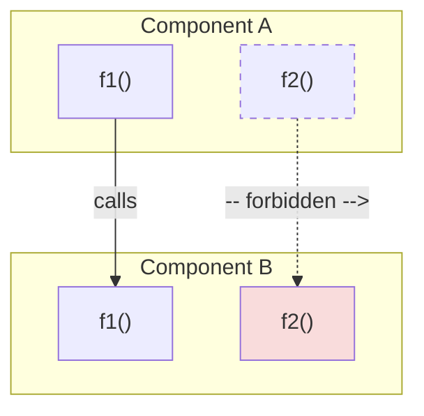
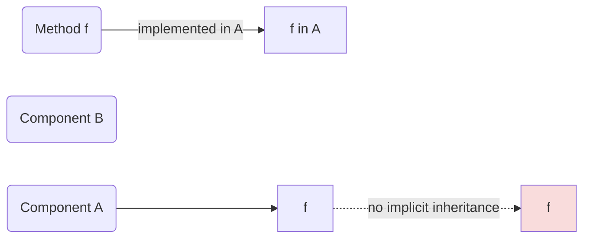
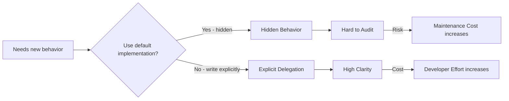
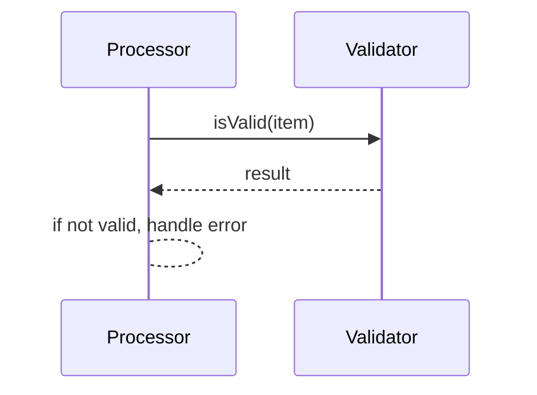

# Explicit Behavior Ownership

## Summary
Memar enforces the principle **"Single Visible Ownership of Behavior"**: every action (method) must have one clear, discoverable owner, and no behavior is inherited, promoted, or injected without being spelled out in source code. This RFC formalizes **Explicit Behavior Ownership (EBO)** as a foundational design principle: only explicitly-defined or explicitly-delegated methods count as behavior of an entity. We reject any language or framework feature that implicitly adds behavior — including inheritance, embedding, trait default methods, method promotion, and opaque macro expansion. All behavior sharing must be explicit and visible.

## Motivation

### The Core Problem: Ownership Ambiguity
Modern software systems offer many mechanisms for reusing behavior: class inheritance, mixins, trait default implementations, Go-style embedding, macro-based code injection, and compiler-synthesized methods. Each mechanism allows behavior to appear in a component without being defined there. The common thread is **ownership ambiguity**: when a method is present in a component, it is not always clear who defined it, who is responsible for it, and where to find its implementation.

This ambiguity is not merely an aesthetic concern. It imposes a real, measurable cost on every developer who reads, debugs, modifies, or reasons about the code. The cost is not in execution time — it is in *understanding time*. And understanding time accumulates across every developer, every code review, every debugging session, and every onboarding experience.

### Hidden Behavior Acquisition
Many mechanisms make behavior appear indirectly in a component. The specific mechanism varies, but the visibility problem is structurally similar:

- **Classical inheritance:** A method defined in a base class appears in all descendants without any code in the descendant.
- **Trait default implementations:** A trait provides a method body; any type implementing the trait acquires that body without writing it.
- **Method promotion (embedding):** Embedding a type within another type causes the inner type's methods to become available on the outer type.
- **Compiler synthesis:** The compiler generates methods (e.g., `equals`, `hashCode`) that appear in the component without being written.
- **Generated implicit methods:** Code generators create methods that exist in the binary but not in the source the developer reads.
- **Macro expansion:** A macro call expands into method definitions that are not visible in the source before expansion.
- **Automatic delegation:** Frameworks or language runtimes automatically delegate calls to embedded or wrapped objects.

Each of these mechanisms solves a legitimate problem — usually reducing boilerplate. But each also introduces a hidden edge in the behavior graph: a method exists in a component, but the component's source code does not show why.

### The Conceptual Foundation of Inheritance Is Itself Questionable

A deeper observation challenges not just the mechanisms of inheritance but the conceptual model itself. The assumption that shared behavior implies a derivation relationship — that one component should "inherit" from another because they share characteristics — is not self-evident. It is an assumption imported from existing language ecosystems without sufficient scrutiny.

An illustrative analogy from outside software makes this clearer. Historically, many societies assumed inheritance-like models for human traits: people often believed that children were essentially *derived* from their fathers — that a child's identity, social standing, profession, and even behavioral tendencies were inherited from the parent. This belief influenced naming systems (patronymic surnames), family structures (patriarchal lineage), and social hierarchies (caste systems, hereditary titles).

Later scientific understanding — genetics, epigenetics, environmental psychology — revealed that reality was significantly more complex. A child is not a derived instance of a parent. Behavioral traits emerge from a complex interaction of genetic material from both parents, environmental factors, education, culture, and individual agency. The "inheritance" model was not merely incomplete — it was *conceptually wrong* as a description of how traits are transmitted.

The purpose of this example is not to prove anything about software through analogy. The purpose is to surface a critical principle:

> **Similarity does not imply ownership transfer. Similarity does not imply behavioral inheritance. Similarity does not imply identity inheritance.**

When two software components share similar behavior, inheritance assumes that one "owns" the behavior and the other receives it through a derivation relationship. But similarity can arise from many causes: shared requirements, convergent design, common domain logic, or independent solutions to the same problem. Inheritance forces a specific causal model (parent-to-child transfer) that may not reflect the actual relationship between the components.

EBO addresses this by refusing to encode any implicit ownership transfer into the system. If two components share behavior, each must define (or explicitly delegate) that behavior independently. The similarity is acknowledged through conformance to shared abstractions (protocols), not through inheritance of implementation.

### Why Boilerplate Is Not the Real Cost
A common argument in favor of implicit behavior mechanisms is that they reduce boilerplate. This framing treats boilerplate as the primary cost of software development. The counterargument is that **understanding cost may matter more than writing cost.**

Consider the lifecycle of a codebase:
1. A method is written once (writing cost).
2. That method is read, understood, debugged, and modified dozens or hundreds of times over its lifetime (understanding cost, repeated).

If implicit mechanisms reduce writing cost by 20% but increase understanding cost by 30% on each of 50 subsequent reads, the total cost is higher, not lower. The economics of software development are dominated by maintenance and comprehension, not initial authoring.

### Trade-Off Reconsideration
Trade-offs in software design are frequently framed as binary: "you get less code but more magic" or "you get more clarity but more verbosity." This framing is misleading.

A more accurate model comes from opportunity-cost thinking: the true cost of a design decision is not the thing itself, but the *time and cognitive capacity that could have been spent elsewhere*. When a developer spends 15 minutes tracing a method through three layers of inheritance to find its implementation, the cost is not 15 minutes — it is whatever the developer would have accomplished in those 15 minutes had the ownership been immediately visible.

### AI Changes the Cost Model
A recurring theme in these discussions is that AI systems are becoming first-class participants in software development. Historically, the assumption was that only humans read and write code. Today, multiple participants exist: humans, linters, compilers, static analyzers, code generators, and AI assistants. Language design should account for this reality.

Explicit systems are inherently more valuable in this multi-participant environment because:
- AI systems can reason about explicit code more reliably. When every method call and its origin are visible, AI-assisted analysis, refactoring, and code generation produce better results.
- Static analysis tools can determine all methods of a component by scanning its code. There is no need to simulate inheritance chains or macro expansions.
- Linters and IDEs can provide accurate documentation, navigation, and refactoring support when behavior ownership is unambiguous.
- Formal verification becomes more feasible when the behavior graph has no hidden edges.

## Guide-level Explanation

### The Principle: One Behavior, One Visible Owner
For any given method (behavior), exactly one component "owns" its implementation. If component `A` has method `foo()`, then `A` is the owner. No other component can claim that same `foo()` belongs to it unless it *explicitly* delegates by writing a method that calls `A.foo()`.

Three questions should always have direct, local answers when looking at any component:
1. **Where was this behavior defined?**
2. **Why is it available here?**
3. **Who owns it?**

If answering any of these questions requires navigating to a different file, understanding an inheritance hierarchy, or running a macro expansion in your head, the system has failed the visibility test.

### The Ownership Discovery Cost Metric
An important metric emerged from these discussions: **Ownership Discovery Cost** — the time and cognitive effort required to determine who owns a given behavior. Not all complexity is execution complexity; some complexity is understanding complexity. The cost of discovering ownership, the cost of understanding behavior, and the cost of navigating the codebase all contribute to the total maintenance burden.

EBO is, at its core, an attempt to minimize ownership discovery cost by ensuring that the answer to "who owns this behavior?" is always visible at the point where the behavior is used.

### Death of Abstraction
A recurring concern is that default implementations in traits and protocols cause a slow "death of abstraction." The pattern unfolds as follows:

1. A trait or protocol is created as a pure abstraction — a set of requirements.
2. Someone adds a default implementation for one method because "most implementers will want this."
3. More default implementations accumulate over time.
4. The abstraction stops being an abstraction. It becomes an implementation container.

At this point, the distinction between abstraction and implementation collapses. The abstraction layer has become the implementation layer. New implementers who want a different behavior must explicitly override the defaults, creating a situation where the "abstraction" is actually a base class in disguise.

EBO prevents this by forbidding default implementations entirely. Abstractions remain pure; all behavior lives in concrete components.

### The Error Example
A practical illustration: suppose an `Error` abstraction defines a method `is_retryable()`. A common design might centralize this behavior in the abstraction itself, perhaps as a default implementation that checks error codes or categories.

The ownership question becomes: who actually owns the `is_retryable()` behavior?
- The abstraction? It declared the requirement.
- A concrete error type? It might need to override the default.
- Multiple concrete error types simultaneously? They might each need different retry logic.

If `is_retryable()` has a default implementation in the abstraction, then the abstraction "owns" the behavior by default, but every concrete type that needs different behavior must fight against that ownership. The result is a confused ownership graph where the abstraction and its implementers are in implicit conflict.

Under EBO, the answer is clear: `is_retryable()` is owned by whichever concrete component defines it. The abstraction only declares that the method must exist. There is no default, no conflict, no ambiguity.

### The Behavior Owner Hypothesis
One emerging hypothesis is that the true owner of behavior should often be the method itself — or more precisely, the component whose code contains the method's definition. Ownership should not be duplicated across multiple entities. Multiple ownership paths increase ambiguity: if `is_retryable()` can be traced back to both an abstraction and a concrete type, which one is the authoritative source?

EBO resolves this by ensuring a single ownership path for every method. The ownership graph is a tree (or forest), not a DAG with multiple parents.

### Explicit Delegation
Delegation is the mechanism by which behavior is shared under EBO. The goal of delegation is not code reuse in the traditional sense — it is **visibility**. When component `A` delegates to component `B`, the source code of `A` must contain a visible call to `B`'s method. Readers of `A`'s code can see:
- **What** is delegated (the method name and signature).
- **Where** it is delegated (the target component).
- **Why** it is delegated (the surrounding logic that explains the delegation decision).

This is fundamentally different from inheritance, where behavior appears without any local indication of its origin.

### Macros: A Nuanced Position
A useful observation from the working notes is that many macros are effectively compile-time function execution. The question becomes: why should the developer necessarily specify exactly where every compile-time operation happens? Some operations may be naturally performed by tooling or compilation processes.

EBO does not reject macros outright. It rejects macros that **hide behavior from the source code the developer reads.** If a macro expands into method definitions that are visible in the source (e.g., via a preprocessor step that generates human-readable code), the visibility requirement is satisfied. If the expansion is opaque — methods exist in the binary but not in any file the developer can read — EBO is violated.

This topic requires future exploration, particularly around the boundary between "transparent code generation" and "opaque macro magic."

## Reference-level Explanation

### Formal Principle
**Explicit Behavior Ownership (EBO):**
For every method `m` present in a component `C`, one of two conditions must be true:
1. `C`'s source code explicitly defines `m`.
2. `C`'s source code contains an explicit delegation call that names another component's method (e.g., `other.m(...)`).

No other mechanism is allowed to introduce method `m` into `C`. In particular:
- There is no implicit copy or aliasing of methods across components.
- A component cannot gain methods through inheritance, embedding, or macro expansion, unless that expansion is present verbatim in the source and under the developer's control.

### Ownership Graph Model
Behavior can be modeled as a directed graph: nodes are components, and edges represent "calls" or "delegates." In typical object-oriented systems, edges often come from inheritance and are implicit. EBO allows only **explicit edges**:

*Figure: Solid arrow = explicit call/delegation (allowed). Dashed arrow = implicit behavior inheritance (forbidden).*

Each method node belongs to exactly one component node. By construction, the graph of ownership is acyclic: one cannot accidentally create ownership loops via inheritance. Every call edge must be written in source code, making the actual behavior graph explicit and inspectable.

*Figure: Only explicit method definitions (solid) are counted. The dashed line shows a prohibited implicit transfer of behavior.*

### Interaction with Protocols
Because of EBO, no protocol or trait may inject behavior. A trait's default method is effectively hidden code — it appears in a component without that component's source defining it. Therefore, EBO forbids default methods in protocols. Protocols remain pure declarative specifications (as defined in the Protocol RFC). Components implementing a protocol must write out each method explicitly, even if the logic is identical across many components.

Code generation is the recommended mechanism for reducing the boilerplate of writing similar implementations across multiple components. The key constraint is that generated code must be visible and auditable — it must exist in files the developer can read, not only in compiler intermediates.

### Decision Flowchart

*Figure: The EBO decision point. Hidden behavior (via defaults, inheritance, macros) reduces initial effort but increases long-term maintenance cost. Explicit delegation increases initial effort but preserves long-term clarity.*

### Explicit Delegation Visualization

*Figure: A component explicitly delegates `isValid` to another component. There is no hidden link — the call is visible in the source code of the delegating component.*

### Tooling Implications
- **Compile-time Checking:** The compiler will enforce that all protocol requirements are satisfied by explicit methods in the implementing component. There is no mechanism for "inheriting" satisfaction.
- **Visibility:** Static analysis and the compiler can determine all methods of a component by scanning its source code. There is no need to search inherited scopes or macro expansions (except fully-expanded, visible code).
- **Documentation:** Each method's owner is documented by its source location. There is no ambiguity about "where did this method come from."
- **AI-Assisted Development:** Explicit code structures are easier for AI models to reason about. When an AI sees a clear chain of calls, it can better verify correctness, suggest improvements, and generate accurate modifications. Hidden behaviors (from mixins, macros, or inheritance) confuse static analysis and AI alike.
- **Code Generation Leverage:** AI can generate all the delegation methods needed for a protocol, then the developer tweaks them. Because the output is fully visible, it stays debuggable and safe. The cost of writing boilerplate is further mitigated, making the extra lines a minor overhead while preserving clarity.

## Drawbacks
- **Increased Boilerplate:** The most obvious cost. Developers must write explicit delegation methods instead of relying on inheritance or default implementations. This is a real, tangible increase in lines of code.
- **Initial Development Speed:** In the early stages of a project, when component hierarchies are shallow, the verbosity of explicit delegation may feel unnecessary. The benefit (reduced understanding cost) compounds over time as the codebase grows.
- **Pattern Migration:** Teams accustomed to inheritance-based design must learn new patterns. Established design patterns (Template Method, Strategy via inheritance, etc.) require alternative formulations using composition and delegation.
- **Generated Code Management:** Heavy reliance on code generation introduces its own tooling requirements. Teams need reliable, auditable code generators and must manage the generated artifacts as part of their workflow.

## Rationale and Alternatives

### Why EBO Over Per-Mechanism Rejection?
An alternative approach is to reject each hidden-behavior mechanism individually: "no inheritance," "no default trait methods," "no method promotion," "no macro-generated methods." This was the approach taken by earlier, separate RFCs (khayyam-rejection_of_inheritance.md, khayyam-rejection_of_default_implementations.md, khayyam-rejection_of_method_promotion.md, khayyam-rejection_of_macros.md).

EBO unifies these rejections under a single principle. The benefit is that future mechanisms — ones we haven't imagined yet — are automatically evaluated against the same rule: does this mechanism introduce behavior without explicit, visible ownership? If yes, it is rejected. If no, it is allowed. This is more robust than maintaining a growing list of forbidden mechanisms.

### Why Not Accept "Controlled" Hidden Behavior?
An alternative is to allow hidden behavior in specific, controlled cases — for example, "default methods are allowed if the trait is marked `@pure`" or "embedding is allowed but only for interfaces." This was rejected because exceptions erode the principle. Every exception creates a new category that developers must learn, remember, and reason about. The cognitive cost of the exception taxonomy may outweigh the benefit of the permitted convenience.

### Why Not Rely on Tooling to Expose Hidden Behavior?
An alternative is to allow hidden behavior but require IDEs and tools to make it visible — for example, showing inherited methods with a "defined in ParentClass" annotation. This was rejected because it places the visibility burden on the tool rather than the source code. The source code should be the ground truth. If understanding a component requires an IDE, the code has already failed the visibility test. Not all environments have rich IDEs — code reviews in web interfaces, diffs in pull requests, and code printed on paper all lose the tooling-provided annotations.

### Impact of Not Doing This
Without EBO, the Memar framework lacks a unifying principle for behavior ownership. Each mechanism is debated in isolation, leading to inconsistent decisions and a growing list of ad-hoc rules. Developers are left to navigate hidden behavior through tooling, documentation, and institutional knowledge — all of which are fragile and incomplete.

## Prior Art

- **Go Interfaces:** Go disallows default methods in interfaces, which aligns with EBO. However, Go allows embedding, which implicitly promotes methods from embedded types. EBO rejects this: the promotion is invisible in the embedding component's source.
- **Java Interfaces (Pre-8):** Java interfaces before version 8 were pure — no default methods. EBO aligns with this design. Java 8's introduction of default methods moved away from this principle.
- **Rust Traits:** Rust traits allow default methods and blanket implementations. Both violate EBO because they introduce behavior without the implementing type's source code defining it.
- **C# Extension Methods:** C# static extension methods can add behavior to types. These methods appear in IntelliSense and API surfaces but are not defined in the type's source. EBO would reject such hidden extensions.
- **Python / Duck Typing:** Python classes can acquire methods via monkey patching, multiple inheritance, and metaclass manipulation. All of these violate EBO. Python's approach prioritizes flexibility over ownership clarity.
- **C++ Multiple Inheritance:** C++ allows multiple inheritance with concrete method bodies, creating complex ownership graphs with diamond inheritance problems. EBO's single-owner rule eliminates this class of ambiguity entirely.
- **Ada Generics:** Ada's generics enable mixin-like behavior where behavior is composed at compile time. The composition is explicit in the generic instantiation, which partially aligns with EBO, but the resulting behavior may still be difficult to trace.

## Unresolved Questions
- **Generated Code Transparency:** If code generators add methods to a component, how do we ensure the resulting code remains auditable? The working answer is: generate source code explicitly (files the developer can read), not opaque binaries or compiler intermediates.
- **Multiple Delegations:** Should a component be allowed to hold references to multiple other components for delegation? Yes — but each delegation relationship must be explicit in the source code.
- **Performance Overhead:** Explicit delegation may introduce slight runtime overhead compared to inlined inherited methods. Is this acceptable? The design favors clarity; performance optimization is the responsibility of compilers and runtime systems, not the source-level design.
- **Dynamic Behavior:** Are dynamic proxies or reflection-based delegation allowed? Generally no — any dynamic addition of methods at runtime breaks EBO because the component's source code does not reflect the full set of available methods.
- **Macro Boundary:** Exactly where is the line between "transparent code generation" and "opaque macro magic"? This requires future exploration and may ultimately be a linter configuration choice rather than a language-level rule.

## Future Possibilities
- **AI-Assisted Delegation Generation:** AI code assistants could generate explicit delegation methods instantly, reducing the boilerplate burden while preserving visibility. The generated code remains in source, auditable and modifiable by the developer.
- **Formal Verification:** EBO's explicit behavior graph enables formal verification of component behavior. Since there are no hidden edges, the verification scope is exactly the source code scope.
- **Ownership Metrics Tooling:** IDEs and linters could compute and display an "ownership clarity score" for each component — a measure of how easily a reader can determine the origin of each behavior.
- **Delegation Pattern Library:** A standardized library of common delegation patterns (forwarding, adapting, decorating) could reduce the cognitive burden of writing explicit delegation without introducing hidden behavior.
- **EBO in Non-Software Domains:** The principle may have applications beyond software — for example, in organizational design, where the clarity of responsibility assignment affects organizational efficiency.

## Change Rationale
Earlier RFCs tackled inheritance, macros, default implementations, and method promotion as separate problems. This RFC unifies them under a single axiom — Explicit Behavior Ownership — making future discussions easier and more consistent. By stating the principle at the outset, we set a clear guideline: if in doubt, favor writing it out.

This RFC was created by splitting the original monolithic "Protocol" document into three focused RFCs. The EBO content was extracted from the second half of that document (originally drafted by ChatGPT) and enriched with content from working notes that were not included in the original draft — including Ownership Discovery Cost, Death of Abstraction, the Error Example, the Behavior Owner hypothesis, AI-era cost model considerations, the nuanced position on macros, and the Social Inheritance Analogy.

The Social Inheritance Analogy was initially placed in khayyam-rejection_of_inheritance.md during the first split. A subsequent boundary review determined that it is a general conceptual argument about the inheritance model's foundation — not a language-specific decision — and therefore belongs in this (EBO) RFC, which addresses design principles. The khayyam RFC addresses only the language-level specification of how that principle is applied.

As one reviewer noted in a related discussion: "protocols and explicit implementations reduce cognitive load" — a benefit that scales as codebases grow. EBO is the principle that makes this possible at the design level.

## Related RFCs

| **RFC** | **Relationship** |
|---------|-----------------|
| protocol.md | **Depends on.** Defines Protocol as a pure declarative specification. EBO enforces that implementations of protocols carry no hidden behavior. |
| khayyam-rejection_of_inheritance.md | **Independent.** Addresses the language-level rejection of inheritance in Khayyam. EBO provides the principled foundation; the Inheritance RFC provides the language-specific application. |
| khayyam-rejection_of_default_implementations.md | **Superseded by** this RFC. Default implementations violate EBO's single-visible-owner rule. |
| khayyam-rejection_of_macros.md | **Superseded by** this RFC. Macros that hide behavior violate EBO; transparent code generation does not. |
| khayyam-rejection_of_inheritance.md | **Superseded by** this RFC (for the behavior-ownership aspect). The Inheritance RFC retains its language-design scope. |
| khayyam-rejection_of_method_promotion.md | **Superseded by** this RFC. Method promotion introduces behavior without explicit source-level ownership. |
| khayyam-protocols_vs_contracts.md | **Depends on** protocol.md. EBO governs how both protocols and contracts are implemented. |
| khayyam-error_abstraction.md | **References.** Uses EBO for error handling patterns — error behaviors must have explicit owners. |