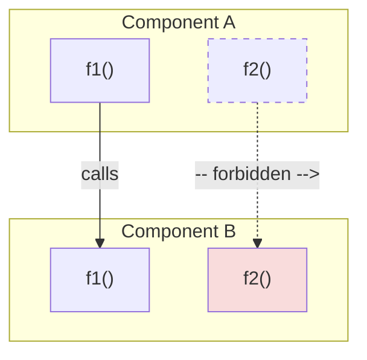
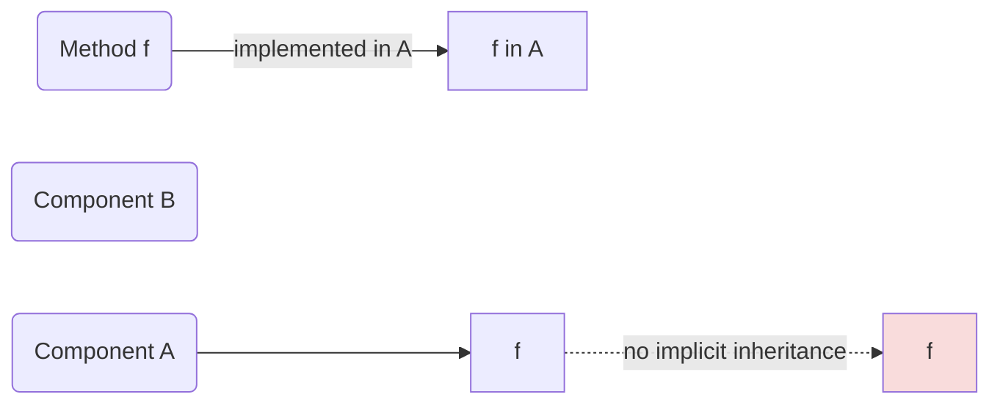
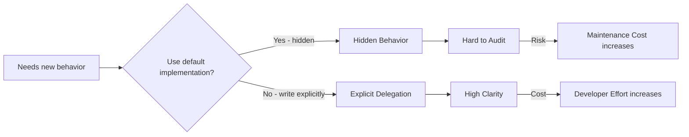
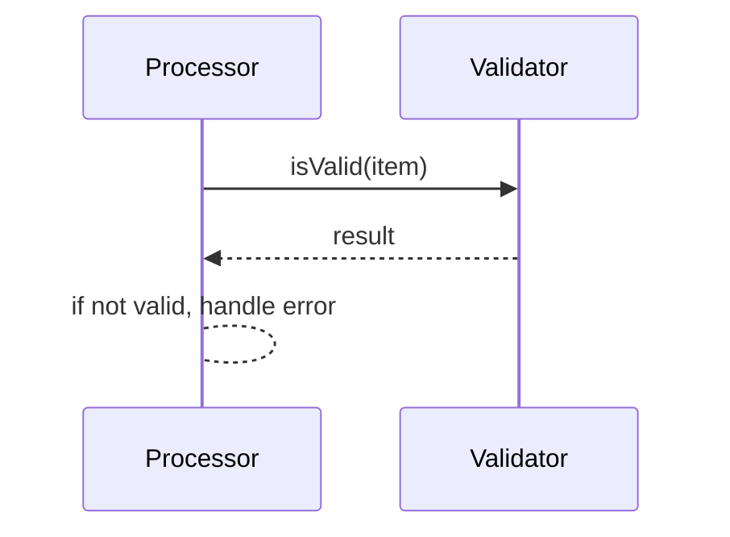

# Explicit Behavior Ownership

## Summary
Memar enforces the principle **"Single Visible Ownership of Behavior"**: every action (method) must have one clear, discoverable owner, and no behavior is inherited, promoted, or injected without being spelled out in source code. This RFC formalizes **Explicit Behavior Ownership (EBO)** as a foundational design principle: only explicitly-defined or explicitly-delegated methods count as behavior of an entity. We reject any language or framework feature that implicitly adds behavior — including inheritance, implementation embedding (where an inner component's methods silently appear on the outer component), trait default methods, method promotion, and opaque macro expansion. Protocol extension (one abstraction extending another) is not affected by EBO because it transfers declarative requirements, not behavioral implementations. All behavior sharing must be explicit and visible.

## Motivation

### The Core Problem: Ownership Ambiguity
Modern software systems offer many mechanisms for reusing behavior: class inheritance, mixins, trait default implementations, Go-style embedding, macro-based code injection, and compiler-synthesized methods. Each mechanism allows behavior to appear in a component without being defined there. The common thread is **ownership ambiguity**: when a method is present in a component, it is not always clear who defined it, who is responsible for it, and where to find its implementation.

This ambiguity is not merely an aesthetic concern. It imposes a real, measurable cost on every developer who reads, debugs, modifies, or reasons about the code. The cost is not in execution time — it is in *understanding time*. And understanding time accumulates across every developer, every code review, every debugging session, and every onboarding experience.

### Hidden Behavior Acquisition
Several mechanisms in modern software make behavior appear in a component without being defined there. These mechanisms are often grouped under the label "inheritance" or discussed as if they are variants of a single concept. They are not — they are independent approaches to a legitimate problem (reducing boilerplate) that happen to share one problematic property: ownership ambiguity. The specific mechanism varies, but the visibility problem is structurally similar:

- **Classical inheritance:** A method defined in a base class appears in all descendants without any code in the descendant.
- **Trait default implementations:** A trait provides a method body; any type implementing the trait acquires that body without writing it.
- **Method promotion (embedding):** Embedding a type within another type causes the inner type's methods to become available on the outer type.
- **Compiler synthesis:** The compiler generates methods (e.g., `equals`, `hashCode`) that appear in the component without being written.
- **Generated implicit methods:** Code generators create methods that exist in the binary but not in the source the developer reads.
- **Macro expansion:** A macro call expands into method definitions that are not visible in the source before expansion.
- **Automatic delegation:** Frameworks or language runtimes automatically delegate calls to embedded or wrapped objects.

Each of these mechanisms solves a legitimate problem — usually reducing boilerplate. But each also introduces a hidden edge in the behavior graph: a method exists in a component, but the component's source code does not show why.

### A Meta-Observation: What These Debates Are Really About

A recurring lesson from discussions about "inheritance" mechanisms is that many apparent disagreements are not about the mechanisms themselves. They are about:
- **Ownership:** Who is responsible for this behavior?
- **Visibility:** Where does this behavior come from?
- **Discoverability:** How do I find the implementation?
- **Structural relationships:** What is the actual relationship between these components?

By addressing ownership, visibility, and discoverability directly — rather than debating which "type of inheritance" is acceptable — the underlying problem is resolved without engaging with a taxonomy whose subject may not exist. EBO takes this approach: it does not categorize or restrict specific mechanisms. It states a positive principle (behavior must have a visible owner) and lets the consequences follow.

### The Conceptual Foundation of "Inheritance" Is Itself Problematic

A deeper observation — not about the mechanisms themselves, but about the conceptual model that makes them seem natural — is worth tracing. The word "inheritance" was not coined by software engineering. It was borrowed from other domains, and tracing that borrowing illuminates why the term carries implications that may not serve software design well.

**Origins: Law and Genetics**

The word enters modern usage through two domains with well-established (and contested) meanings:

*Legal inheritance* (*hereditas* in Roman law) concerns the transfer of property or rights from a deceased person to an heir. Even within law, "inheritance" is not a single, stable concept. Roman law already distinguished between *succession to rights* (*successio in personam*) and *succession to property* (*successio in rem*) — two fundamentally different transfers unified under one word. Islamic inheritance law (*farāʾiḍ*) defines inheritance through mathematically fixed shares that differ sharply from both Roman and common-law traditions. Common law grants testamental freedom; civil law (the Napoleonic code) imposes forced heirship. These traditions disagree not merely on rules but on what "inheritance" *means*. Yet all of them agree on one thing: inheritance is the transfer of **property or rights**, never the transfer of **capabilities or behavior**. A person who inherits a piano does not inherit the previous owner's ability to play. A person who inherits a company does not inherit the founder's business judgment.

*Genetic inheritance* — the domain from which software most directly borrowed the metaphor — describes the transmission of genetic material (DNA) from parent to offspring. But even in its home domain, the word does not mean what software assumes it means:

- Genes do not carry behavior. A gene carries instructions for protein synthesis. Behavior emerges from complex gene-environment interactions — epigenetics, neural development, learning, culture.
- Genetic material comes from **two** parents, not one "base class." Mendelian inheritance describes the recombination of alleles from both parents, not the copying of traits from a single source.
- Even Mendel — the foundational figure — distinguished between **genotype** (inherited genetic makeup) and **phenotype** (observed characteristics). The distinction exists precisely because inheritance and expression are not the same thing.

**How Software Borrowed and Misapplied the Term**

The principles that software calls "inheritance" — reuse of structure, sharing of behavior, hierarchical classification — are valuable and predate OOP. What OOP introduced was a specific biological metaphor to describe these principles. The metaphor provided useful initial intuition, but also carried implications that diverge from the actual mechanisms at work. "Classical" inheritance (C++, Java) transferred both structure and behavior from a single parent — a model with no parallel in genetics (which involves two parents) or law (which transfers property, not capabilities). When later languages recognized the resulting tensions and attempted partial fixes, each fix required a new term precisely because the original metaphor could not be repaired from within: Go introduced "embedding" and "interfaces" — but embedding still implicitly promotes methods. Rust introduced "traits with default implementations" — behavior injection under a different name. Each of these is an independent attempt to solve the legitimate problem of reducing boilerplate. None of them is a "type" or "variant" of inheritance. They are separate mechanisms that happen to share one problematic property: they make behavior appear in a component without that component's source code defining it.

**The Relationship Between Protocols: Extension, Not Behavior Transfer**

There is one domain in software where a relationship structurally analogous to genetic inheritance occurs: when an abstraction (protocol) extends another abstraction. Protocol A extends Protocol B means that any entity conforming to A must also satisfy B's requirements. B's requirements are not modified by this relationship — they exist independently, and A adds new requirements on top. This is, in fact, the closest software analog to genetic inheritance: a "parent" specification whose requirements flow to a "child" specification without the parent being altered, with the child building further on top while the inherited base remains intact.

EBO does not challenge this relationship. What EBO challenges is the transfer of *behavioral implementations* — methods with bodies, logic, and side effects. Protocol extension transfers *declarative requirements* (signatures, constraints), which is a fundamentally different kind of transfer: it adds obligations without adding any mechanism for fulfilling them. An implementation of Protocol A must define the methods declared by both A and B — the implementation is written by the developer, owned by the developer, and visible in the developer's source code. No behavior is inherited; only requirements are extended.

The preference for the term "extension" over "inheritance" in Memar's documentation is a terminological choice, not a claim that the structural relationship is fundamentally different. The word "inheritance" in software discourse is so thoroughly associated with *behavioral* transfer that using it for protocol extension risks importing assumptions about behavior that don't apply. Using "extension" avoids this terminological baggage while describing the same structural relationship. The principle — not the word — is what matters: requirements may be extended; behavior must always be explicitly owned.

**Why Categorizing "Types of Inheritance" Accepts a False Premise**

A common practice in software discourse is to split inheritance into categories: "good inheritance" vs. "bad inheritance," "type inheritance" vs. "implementation inheritance," "interface inheritance" vs. "behavioral inheritance." This framing assumes that inheritance is a coherent concept with variants — some desirable, some problematic.

EBO's position is that this taxonomy has no subject. The concept of "inheritance" — as defined in its legal and genetic home domains — does not apply to behavioral transfer between software components. The various mechanisms labeled "inheritance" in software (classical inheritance, trait defaults, method promotion, mixin composition) are not variants of a single concept. They are independent solutions to the same problem (boilerplate reduction) that each carry the same cost (ownership ambiguity). Categorizing them as "types of inheritance" is an exercise in taxonomy without a subject.

EBO refuses to engage with this taxonomy. Instead, it addresses the underlying problem directly: behavior must have a visible, discoverable owner, regardless of what label is attached to the mechanism that attempts to hide that ownership.

When two components share behavior, EBO requires each to define (or explicitly delegate) that behavior independently. The similarity is acknowledged through conformance to shared abstractions (protocols) — a structural relationship correctly described as *extension*, not *inheritance*.

### Why Boilerplate Is Not the Real Cost
A common argument in favor of implicit behavior mechanisms is that they reduce boilerplate. This framing treats boilerplate as the primary cost of software development. The counterargument is that **understanding cost may matter more than writing cost.**

Consider the lifecycle of a codebase:
1. A method is written once (writing cost).
2. That method is read, understood, debugged, and modified dozens or hundreds of times over its lifetime (understanding cost, repeated).

If implicit mechanisms reduce writing cost by 20% but increase understanding cost by 30% on each of 50 subsequent reads, the total cost is higher, not lower. The economics of software development are dominated by maintenance and comprehension, not initial authoring.

### Trade-Off Reconsideration
Trade-offs in software design are frequently framed as binary: "you get less code but more magic" or "you get more clarity but more verbosity." This framing is misleading.

A more accurate model comes from opportunity-cost thinking: the true cost of a design decision is not the thing itself, but the *time and cognitive capacity that could have been spent elsewhere*. When a developer spends 15 minutes tracing a method through three layers of inheritance to find its implementation, the cost is not 15 minutes — it is whatever the developer would have accomplished in those 15 minutes had the ownership been immediately visible.

This argument applies regardless of the reader's capability. A highly experienced developer or a powerful AI model can trace a complex inheritance chain — the question is not *whether* they can, but *what else they could have done with the same cognitive resources*. Cognitive capacity, whether human or computational, is finite. Every unit of processing spent on resolving hidden behavior paths is a unit not spent on the actual problem the code is meant to solve. This is not a limitation that better hardware or even fundamentally different computing paradigms will eliminate — it is a structural property of any system where understanding has a cost.

### AI Changes the Cost Model
A recurring theme in these discussions is that AI systems are becoming first-class participants in software development. Historically, the assumption was that only humans read and write code. Today, multiple participants exist: humans, linters, compilers, static analyzers, code generators, and AI assistants. Language design should account for this reality.

Explicit systems are inherently more valuable in this multi-participant environment because:
- AI systems can reason about explicit code more reliably. When every method call and its origin are visible, AI-assisted analysis, refactoring, and code generation produce better results.
- Static analysis tools can determine all methods of a component by scanning its code. There is no need to simulate inheritance chains or macro expansions.
- Linters and IDEs can provide accurate documentation, navigation, and refactoring support when behavior ownership is unambiguous.
- Formal verification becomes more feasible when the behavior graph has no hidden edges.

#### Explicit Code as a Structural Advantage, Not a Cost

The boilerplate argument deserves a more fundamental reframing in the AI era. We are no longer in an era where algorithms are developed on paper and a human "compiler" translates them to punch cards. AI is an irremovable participant in the development process — and this changes the economics of code clarity fundamentally.

When AI generates the explicit delegation code that replaces an implicit inheritance chain, two things happen simultaneously: the **writing cost drops to near zero** (AI generates the boilerplate), and the **understanding cost drops structurally** (every method's origin is visible in the source). The traditional trade-off — "less code but more magic" vs. "more code but more clarity" — collapses. You get both: minimal human writing effort *and* maximum readability.

This is not merely a mitigation of boilerplate. It is a qualitative shift. A language whose code is more naturally understandable by AI is a language that receives better AI-assisted refactoring, more accurate code review, and more reliable automated testing. Explicit code structure becomes a **language-level competitive advantage** in an ecosystem where AI-assisted development is the norm, not the exception.

The implication is counterintuitive but important: the boilerplate that EBO requires is not a cost to be mitigated — it is the mechanism through which the code becomes AI-legible. Just as meaningful variable names exist not for the compiler (which needs only addresses) but for the human reader, explicit behavior ownership exists not for the machine but for every participant — human or AI — that needs to understand the code.

## Guide-level Explanation

### The Principle: One Behavior, One Visible Owner
For any given method (behavior), exactly one component "owns" its implementation. If component `A` has method `foo()`, then `A` is the owner. No other component can claim that same `foo()` belongs to it unless it *explicitly* delegates by writing a method that calls `A.foo()`.

Three questions should always have direct, local answers when looking at any component:
1. **Where was this behavior defined?**
2. **Why is it available here?**
3. **Who owns it?**

If answering any of these questions requires understanding an inheritance hierarchy, running a macro expansion in your head, or consulting documentation beyond the source code itself, the system has failed the visibility test. Note that navigating to a different file to see a delegation target's implementation details is not a failure — the three questions above are answered locally by the explicit delegation call; the navigation is for depth, not for discovery.

### The Ownership Discovery Cost Metric
An important metric emerged from these discussions: **Ownership Discovery Cost** — the time and cognitive effort required to determine who owns a given behavior. Not all complexity is execution complexity; some complexity is understanding complexity. The cost of discovering ownership, the cost of understanding behavior, and the cost of navigating the codebase all contribute to the total maintenance burden.

EBO is, at its core, an attempt to minimize ownership discovery cost by ensuring that the answer to "who owns this behavior?" is always visible at the point where the behavior is used.

### Death of Abstraction
A recurring concern is that default implementations in traits and protocols cause a slow "death of abstraction." The pattern unfolds as follows:

1. A trait or protocol is created as a pure abstraction — a set of requirements.
2. Someone adds a default implementation for one method because "most implementers will want this."
3. More default implementations accumulate over time.
4. The abstraction stops being an abstraction. It becomes an implementation container.

At this point, the distinction between abstraction and implementation collapses. The abstraction layer has become the implementation layer. New implementers who want a different behavior must explicitly override the defaults, creating a situation where the "abstraction" is actually a base class in disguise.

EBO prevents this by forbidding default implementations entirely. Abstractions remain pure; all behavior lives in concrete components.

### The Error Example
A practical illustration: suppose an `Error` abstraction defines a method `is_retryable()`. A common design might centralize this behavior in the abstraction itself, perhaps as a default implementation that checks error codes or categories.

The ownership question becomes: who actually owns the `is_retryable()` behavior?
- The abstraction? It declared the requirement.
- A concrete error type? It might need to override the default.
- Multiple concrete error types simultaneously? They might each need different retry logic.

If `is_retryable()` has a default implementation in the abstraction, then the abstraction "owns" the behavior by default, but every concrete type that needs different behavior must fight against that ownership. The result is a confused ownership graph where the abstraction and its implementers are in implicit conflict.

Under EBO, the answer is clear: `is_retryable()` is owned by whichever concrete component defines it. The abstraction only declares that the method must exist. There is no default, no conflict, no ambiguity.

### The Behavior Owner Hypothesis
One emerging hypothesis is that the true owner of behavior should often be the method itself — or more precisely, the component whose code contains the method's definition. Ownership should not be duplicated across multiple entities. Multiple ownership paths increase ambiguity: if `is_retryable()` can be traced back to both an abstraction and a concrete type, which one is the authoritative source?

EBO resolves this by ensuring a single ownership path for every method. The ownership graph is a tree (or forest), not a DAG with multiple parents.

### Explicit Delegation
Delegation is the mechanism by which behavior is shared under EBO. The goal of delegation is not code reuse in the traditional sense — it is **visibility**. When component `A` delegates to component `B`, the source code of `A` must contain a visible call to `B`'s method. Readers of `A`'s code can see:
- **What** is delegated (the method name and signature).
- **Where** it is delegated (the target component).
- **Why** it is delegated (the surrounding logic that explains the delegation decision).

This is fundamentally different from inheritance, where behavior appears without any local indication of its origin.

### Macros: A Nuanced Position
A useful observation from the working notes is that many macros are effectively compile-time function execution. The question becomes: why should the developer necessarily specify exactly where every compile-time operation happens? Some operations may be naturally performed by tooling or compilation processes.

EBO does not reject macros outright. It rejects macros that **hide behavior from the source code the developer reads.** If a macro expands into method definitions that are visible in the source (e.g., via a preprocessor step that generates human-readable code), the visibility requirement is satisfied. If the expansion is opaque — methods exist in the binary but not in any file the developer can read — EBO is violated.

This topic requires future exploration, particularly around the boundary between "transparent code generation" and "opaque macro magic."

### Generics and Ownership Ambiguity

Generics (type parameters such as `List<T>`) introduce a form of ownership ambiguity that is structurally similar to the mechanisms EBO rejects, even though generics are not typically discussed alongside inheritance or method promotion.

Consider `List<T>.Add(T item)`. The `Add` method is defined in the generic template `List<T>`, but the actual types that use it are `List<Connection>`, `List<Service>`, and so on. Who owns the behavior of `List<Connection>.Add()`? The template `List<T>` defines it, but `List<Connection>` is the type whose instances actually execute it. The implementation lives in one place; the type that "has" the method is a different, parameterized instantiation. Navigating from `List<Connection>` to the actual implementation of `Add` requires understanding the generic type system — a form of ownership discovery cost.

More fundamentally, a developer reading the source of a domain-specific capsule that uses `List<Connection>` cannot see the behavior of `Add` in that source. The behavior is defined elsewhere, in the generic template. This violates the visibility test: answering "where was this behavior defined?" requires navigating to a different file and understanding parameter substitution. The same principle applies regardless of whether the mechanism is classical inheritance, trait defaults, or generic type parameters — if a method is present on a type but its implementation is not visible in that type's source, ownership is ambiguous.

EBO's position aligns with and provides principled support for Khayyam's rejection of generic syntax. The domain-specific capsule approach — defining a `ConnectionList` capsule with its own explicitly defined `Add` method — satisfies EBO because every method visible on `ConnectionList` is defined in `ConnectionList`'s source code, either directly or through explicit delegation to an internal data structure. There is no hidden edge in the behavior graph. The detailed language-level specification of this approach is in the Containers, Generics Elimination, and Rich Domain Models RFC.

## Reference-level Explanation

### Formal Principle
**Explicit Behavior Ownership (EBO):**
For every method `m` present in a component `C`, one of two conditions must be true:
1. `C`'s source code explicitly defines `m`.
2. `C`'s source code contains an explicit delegation call that names another component's method (e.g., `other.m(...)`).

No other mechanism is allowed to introduce method `m` into `C`. In particular:
- There is no implicit copy or aliasing of methods across components.
- A component cannot gain methods through inheritance, capsule embedding (where an inner capsule's methods silently appear on the outer capsule), or macro expansion, unless that expansion is present verbatim in the source and under the developer's control.
- Protocol extension (one abstraction extending another) is not a form of behavior acquisition and is unaffected by this rule.

### Ownership Graph Model
Behavior can be modeled as a directed graph: nodes are components, and edges represent "calls" or "delegates." In typical object-oriented systems, edges often come from inheritance and are implicit. EBO allows only **explicit edges**:

*Figure: Solid arrow = explicit call/delegation (allowed). Dashed arrow = implicit behavior inheritance (forbidden).*

Each method node belongs to exactly one component node. By construction, the graph of ownership is acyclic: one cannot accidentally create ownership loops via inheritance. Every call edge must be written in source code, making the actual behavior graph explicit and inspectable.

*Figure: Only explicit method definitions (solid) are counted. The dashed line shows a prohibited implicit transfer of behavior.*

### Interaction with Protocols
Because of EBO, no protocol or trait may inject behavior. A trait's default method is effectively hidden code — it appears in a component without that component's source defining it. Therefore, EBO forbids default methods in protocols. Protocols remain pure declarative specifications (as defined in the Protocol RFC). Components implementing a protocol must write out each method explicitly, even if the logic is identical across many components.

Code generation is the recommended mechanism for reducing the boilerplate of writing similar implementations across multiple components. The key constraint is that generated code must be visible and auditable — it must exist in files the developer can read, not only in compiler intermediates.

### Decision Flowchart

*Figure: The EBO decision point. Hidden behavior (via defaults, inheritance, macros) reduces initial effort but increases long-term maintenance cost. Explicit delegation increases initial effort but preserves long-term clarity.*

### Explicit Delegation Visualization

*Figure: A component explicitly delegates `isValid` to another component. There is no hidden link — the call is visible in the source code of the delegating component.*

### Tooling Implications
- **Compile-time Checking:** The compiler will enforce that all protocol requirements are satisfied by explicit methods in the implementing component. There is no mechanism for "inheriting" satisfaction.
- **Visibility:** Static analysis and the compiler can determine all methods of a component by scanning its source code. There is no need to search inherited scopes or macro expansions (except fully-expanded, visible code).
- **Documentation:** Each method's owner is documented by its source location. There is no ambiguity about "where did this method come from."
- **AI-Assisted Development:** Explicit code structures are easier for AI models to reason about. When an AI sees a clear chain of calls, it can better verify correctness, suggest improvements, and generate accurate modifications. Hidden behaviors (from mixins, macros, or inheritance) confuse static analysis and AI alike.
- **Code Generation Leverage:** AI can generate explicit delegation methods on demand, and linters can scaffold them proactively. The generated code is fully visible, auditable, and modifiable — it stays debuggable and safe. Crucially, this inverts the traditional boilerplate trade-off: the explicit structure that EBO requires is not a cost that AI mitigates, but a property that AI leverages to produce better analysis, refactoring, and verification. The extra lines of code serve as the substrate that makes AI-assisted reasoning more reliable.

## Drawbacks
- **Increased Boilerplate:** The most obvious cost. Developers must write explicit delegation methods instead of relying on inheritance or default implementations. This is a real, tangible increase in lines of code. However, in an AI-assisted development environment, the writing cost of boilerplate is substantially reduced — AI can generate delegation methods, and linters can scaffold them. The remaining lines of code serve a purpose: they make behavior ownership visible to every reader, human or AI. The trade-off shifts from "more code vs. hidden behavior" to "more code AND clear behavior."
- **Initial Development Speed:** In the early stages of a project, when component hierarchies are shallow, the verbosity of explicit delegation may feel unnecessary. The benefit (reduced understanding cost) compounds over time as the codebase grows.
- **Pattern Migration:** Teams accustomed to inheritance-based design must learn new patterns. Established design patterns (Template Method, Strategy via inheritance, etc.) require alternative formulations using composition and delegation. However, this drawback carries a corresponding benefit: it acts as a natural filter. Languages like Go and Rust demonstrated that principled deviations from OO norms attract developers who value those principles. The initial adoption barrier selects for developers who are willing to think critically about design trade-offs, which tends to produce healthier long-term communities.
- **Generated Code Management:** Heavy reliance on code generation introduces its own tooling requirements. Teams need reliable, auditable code generators and must manage the generated artifacts as part of their workflow.

## Rationale and Alternatives

### Why EBO Over Per-Mechanism Rejection?
An alternative approach is to reject each hidden-behavior mechanism individually: "no inheritance," "no default trait methods," "no method promotion," "no macro-generated methods." This was the approach taken by earlier, separate RFCs (khayyam-inheritance.md, khayyam-rejection_of_default_implementations.md, khayyam-rejection_of_method_promotion.md, khayyam-rejection_of_macros.md).

EBO unifies these rejections under a single principle. The benefit is that future mechanisms — ones we haven't imagined yet — are automatically evaluated against the same rule: does this mechanism introduce behavior without explicit, visible ownership? If yes, it is rejected. If no, it is allowed. This is more robust than maintaining a growing list of forbidden mechanisms.

### Why Not Accept "Controlled" Hidden Behavior?
An alternative is to allow hidden behavior in specific, controlled cases — for example, "default methods are allowed if the trait is marked `@pure`" or "capsule embedding is allowed but only when the embedded type is an interface-like abstraction (not a concrete implementation)." This was rejected for two reasons.

First, exceptions erode the principle. Every exception creates a new category that developers must learn, remember, and reason about. The cognitive cost of the exception taxonomy may outweigh the benefit of the permitted convenience. But more fundamentally, any permission to introduce hidden behavior is an opening for exactly the problems EBO was designed to prevent. There is no practically definable "safe" subset of hidden behavior — the boundary between "acceptable" and "problematic" inheritance is subjective, context-dependent, and shifts over time as exceptions accumulate. Each new exception requires its own enforcement mechanism, its own review process, and its own documentation — consuming the very resources the exception was meant to save. The question is not whether a clever enough set of rules could theoretically permit some inheritance safely, but who enforces those rules, in every pull request, across every team, at what cost — and whether a compiler-level guarantee is not simply more reliable.

Second, allowing the mechanism but restricting it through conventions creates an enforcement gap. The evidence from existing ecosystems is instructive: many successful Java and C# teams already follow EBO-like rules as team conventions — "prefer composition over inheritance," "no deep hierarchies," "no concrete base classes." These teams have independently arrived at the same conclusions EBO formalizes. But the language cannot enforce these conventions at the compiler level. Instead, the enforcement burden shifts to code reviews, linter configurations, team guidelines, and institutional knowledge — all of which are fragile, incomplete, and expensive to maintain. Every pull request must be checked against conventions that the compiler could have enforced for free. EBO's position is: if the convention is nearly universal among high-performing teams, encode it in the language and let the compiler do the work.

### Why Not Rely on Tooling to Expose Hidden Behavior?
An alternative is to allow hidden behavior but require IDEs and tools to make it visible — for example, showing inherited methods with a "defined in ParentClass" annotation. This was rejected because it places the visibility burden on the tool rather than the source code. The source code should be the ground truth. If understanding a component requires an IDE, the code has already failed the visibility test. Not all environments have rich IDEs — code reviews in web interfaces, diffs in pull requests, and code printed on paper all lose the tooling-provided annotations.

### Why Not Define Inheritance Precisely and Allow Only the Precise Form?
An alternative is to accept the concept of inheritance but define it precisely — for example, "inheritance is allowed but only for protocol extension, not for behavior transfer." This was rejected because it engages with a taxonomy whose subject does not exist. As established in the Motivation section, "inheritance" does not meaningfully apply to behavioral transfer between software components. Protocol extension is already correctly named "extension" — it transfers declarative requirements, not behavior, and EBO does not challenge it. Defining a "precise" form of a concept that is itself inapplicable gives the concept more legitimacy than it deserves. The correct response is not to narrow the concept but to name what is actually happening: behavior sharing through explicit delegation (for implementations) and extension (for protocols), governed by the EBO principle.

### Impact of Not Doing This
Without EBO, the Memar framework lacks a unifying principle for behavior ownership. Each mechanism is debated in isolation, leading to inconsistent decisions and a growing list of ad-hoc rules. Developers are left to navigate hidden behavior through tooling, documentation, and institutional knowledge — all of which are fragile and incomplete.

## Prior Art

- **Go Interfaces:** Go disallows default methods in interfaces, which aligns with EBO. However, Go allows embedding, which implicitly promotes methods from embedded types. EBO rejects this: the promotion is invisible in the embedding component's source.
- **Java Interfaces (Pre-8):** Java interfaces before version 8 were pure — no default methods. EBO aligns with this design. Java 8's introduction of default methods moved away from this principle.
- **Rust Traits:** Rust traits allow default methods and blanket implementations. Both violate EBO because they introduce behavior without the implementing type's source code defining it.
- **C# Extension Methods:** C# static extension methods can add behavior to types. These methods appear in IntelliSense and API surfaces but are not defined in the type's source. EBO would reject such hidden extensions.
- **Python / Duck Typing:** Python classes can acquire methods via monkey patching, multiple inheritance, and metaclass manipulation. All of these violate EBO. Python's approach prioritizes flexibility over ownership clarity.
- **C++ Multiple Inheritance:** C++ allows multiple inheritance with concrete method bodies, creating complex ownership graphs with diamond inheritance problems. EBO's single-owner rule eliminates this class of ambiguity entirely.
- **Ada Generics:** Ada's generics enable mixin-like behavior where behavior is composed at compile time. The composition is explicit in the generic instantiation, which partially aligns with EBO, but the resulting behavior may still be difficult to trace.

A common thread across all of these prior art examples: each language implicitly accepts that "inheritance" (or its equivalents) is a coherent concept to be refined, restricted, or worked around. EBO's position is that the concept itself — as a model for behavioral transfer — is what needs examination, not its specific implementations.

## Unresolved Questions
- **Generated Code Transparency:** If code generators add methods to a component, how do we ensure the resulting code remains auditable? The working answer is: generate source code explicitly (files the developer can read), not opaque binaries or compiler intermediates.
- **Multiple Delegations:** Should a component be allowed to hold references to multiple other components for delegation? Yes — but each delegation relationship must be explicit in the source code.
- **Performance Overhead:** Explicit delegation may introduce slight runtime overhead compared to inlined inherited methods. Is this acceptable? The design favors clarity; performance optimization is the responsibility of compilers and runtime systems, not the source-level design.
- **Dynamic Behavior:** Are dynamic proxies or reflection-based delegation allowed? Generally no — any dynamic addition of methods at runtime breaks EBO because the component's source code does not reflect the full set of available methods.
- **Macro Boundary:** Exactly where is the line between "transparent code generation" and "opaque macro magic"? The guiding principle should be human cognitive accessibility — the same principle that motivates meaningful variable names over opaque identifiers. We do not name variables `x42` even though the compiler does not care, because humans need to read and reason about the code. Similarly, generated behavior should be readable and navigable by a human without special tooling. This requires future exploration and may ultimately be a linter configuration choice rather than a language-level rule.

## Future Possibilities
- **AI-Assisted Delegation Generation:** AI code assistants could generate explicit delegation methods instantly, reducing the boilerplate burden while preserving visibility. The generated code remains in source, auditable and modifiable by the developer.
- **Formal Verification:** EBO's explicit behavior graph enables formal verification of component behavior. Since there are no hidden edges, the verification scope is exactly the source code scope.
- **Ownership Metrics Tooling:** IDEs and linters could compute and display an "ownership clarity score" for each component — a measure of how easily a reader can determine the origin of each behavior.
- **Delegation Pattern Library:** A standardized library of common delegation patterns (forwarding, adapting, decorating) could reduce the cognitive burden of writing explicit delegation without introducing hidden behavior.
- **EBO in Non-Software Domains:** The principle may have applications beyond software — for example, in organizational design, where the clarity of responsibility assignment affects organizational efficiency.

## Change Rationale
Earlier RFCs tackled inheritance, macros, default implementations, and method promotion as separate problems. This RFC unifies them under a single axiom — Explicit Behavior Ownership — making future discussions easier and more consistent. By stating the principle at the outset, we set a clear guideline: if in doubt, favor writing it out.

This RFC was created by splitting the original monolithic "Protocol" document into three focused RFCs. The EBO content was extracted from the second half of that document (originally drafted by ChatGPT) and enriched with content from working notes that were not included in the original draft — including Ownership Discovery Cost, Death of Abstraction, the Error Example, the Behavior Owner hypothesis, AI-era cost model considerations, the nuanced position on macros, and the Social Inheritance Analogy.

The Social Inheritance Analogy was initially placed in khayyam-inheritance.md during the first split. A subsequent boundary review determined that it is a general conceptual argument about the inheritance model's foundation — not a language-specific decision — and therefore belongs in this (EBO) RFC, which addresses design principles. The khayyam RFC addresses only the language-level specification of how that principle is applied.

As one reviewer noted in a related discussion: "protocols and explicit implementations reduce cognitive load" — a benefit that scales as codebases grow. EBO is the principle that makes this possible at the design level.
