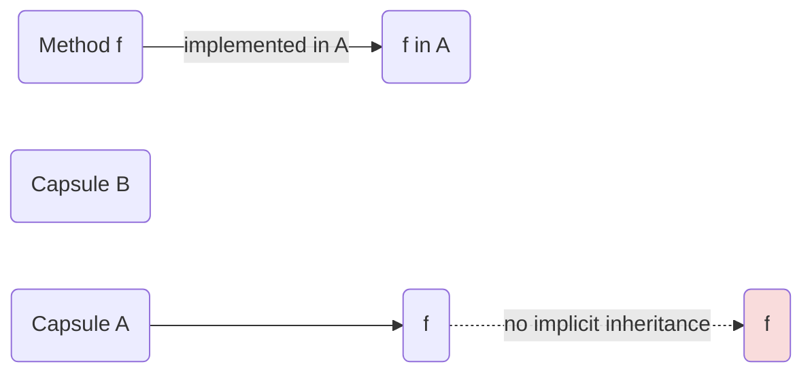
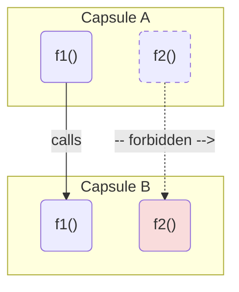
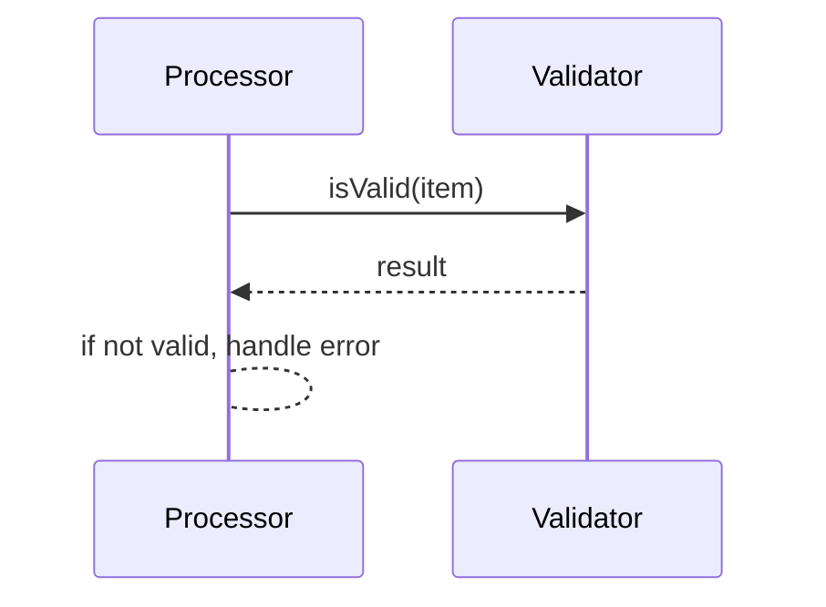
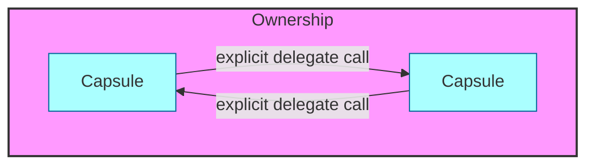

# Protocol

## Summary  
Protocols are **abstract rule sets** that govern interactions between independent components. Unlike concrete `Contracts`, which imply parties and obligations, or `Standards`, which imply formal approval, a *Protocol* is a language-agnostic specification of messages, formats, and exchange sequences. In the Memar framework, **Protocols** are **first-class abstractions** that define *what* needs to happen in an interaction, but they do **not** carry implementation or state. This RFC formalizes the definition of “Protocol” in Memar, distinguishes it from related concepts (Contract, Standard, Specification, Interface, Policy), and establishes rules for protocol composition, inheritance, and conformance. It also situates Memar’s notion of Protocol in a broader context of industry standards (ISO, ACORD, HL7, FHIR, POSIX, etc.) and networking protocols (HTTP, TCP/IP).

Key points:  
- A *Protocol* is a **machine-readable specification** of rules (formats, procedures, message flows) for communication or interaction.  
- A *Protocol* **owns no behavior or data**; it only *declares* requirements. Implementations (e.g. Capsules in Khayyam) must satisfy the protocol by providing concrete behavior.  
- A *Standard* or *Specification* is a social/official instantiation of a protocol (often managed by ISO/IETF/industry bodies) that many parties agree to follow.  
- A *Contract* (in Design-by-Contract) is a runtime guarantee between parties (pre-/post-conditions). In contrast, a Memar **Protocol** has no inherent “parties” or dynamic checks; it is static and abstract.  
- **Protocols can be combined** via composition or inheritance of their declarative requirements, but **must not acquire concrete behavior or state** from those compositions.  
- The Memar rule is **“One Protocol, One Intent”**: each protocol is an **interface-level contract** without default methods or fields. All behavior must be implemented explicitly by a Capsule or provided via explicit delegation.

This RFC motivates why protocols are defined this way, provides examples (e.g. HTTP as protocol vs standard) and formalizes rules of protocol composition. It also outlines how Memar’s **protocol-centric design** affects the language (no default methods, no trait auto-implementation) and tooling (e.g. AI codegen can fill boilerplate without breaking protocol purity).

## Motivation  

### Terminology and Confusion  
The term “protocol” is widely used but often conflated with **“standard”** or **“contract”**. In network engineering, a *protocol* is a set of rules for data exchange (formats and procedures). In object-oriented programming, terms like “interface”, “trait”, or Swift’s “protocol” are similar to abstract type descriptions. Even then, many practitioners loosely call a *protocol* whatever they standardize (e.g. “HTTP protocol” or “the HTTP standard” interchangeably). To avoid confusion, we must clearly define Protocol in Memar:

- **Protocol ≠ Standard:** A *Standard* implies broad adoption or official ratification (e.g. by IETF or ISO).  A *Protocol* is the abstract rule set, which *can* be standard, but need not be. _Example_: HTTP’s rules are defined in RFCs (the “HTTP protocol”). The protocol specification became a Standard via IETF and W3C agreement. In Memar, we separate the abstract protocol from its ratification status.  
- **Protocol ≠ Contract:** A *Contract* often means a mutual agreement or runtime assertion (Design-by-Contract). Protocols in Memar do not imply two parties negotiating; instead, they are *one-sided interfaces*.  There is no “counterparty” in a Memar protocol; any Capsule can “implement” it by satisfying its requirements.  
- **Protocol ≠ Specification:** A specification is *how* a protocol is documented; a protocol is *what* is documented.  As one authority notes, “a specification can be used as a standard, but being a standard also carries the weight of social agreement”. In Memar, we treat a protocol as the conceptual contract, regardless of whether a standards body formalizes it.  
- **Protocol vs Interface/Type:** An interface (or protocol type in languages) is the code-level counterpart of a protocol concept. However, Memar’s Protocol is a **language-level abstraction** with rules (e.g. allowed operations) but without behavior. It behaves like an interface (method signatures only) but stricter: *no default implementations, no fields*.  
- **Protocol vs Policy:** Policies (e.g. organizational policies) are guidelines for behavior or usage, often with discretionary enforcement. A Memar Protocol is narrower: it precisely defines data formats and call sequences, not high-level organizational goals.  

### Principles of Protocols in Memar  
The core principle is that **Protocols are pure abstractions**. They do not own implementation. Every method or operation declared in a protocol must be explicitly provided by the implementing entity (a Capsule or other unit). This design preserves modularity and clarity: anyone can read a Capsule’s code and see exactly what behavior it has. No hidden default logic “leaks in” from protocols.  

Memar adopts “protocols over contracts”: protocols specify *roles* or *behaviors required* without binding to particular data sources or implementations. This avoids coupling and allows multiple implementations. For example, a `Database` protocol might declare CRUD methods; different Capsules (PostgresCapsule, InMemoryCapsule) implement them according to context. The protocol itself remains abstract and stateless.  

### Concrete Problems Addressed  
- **Hidden Behavior**: In languages with default interface methods or mixins, a high-level type may acquire behavior from multiple sources, making it hard to know its exact functionality. Memar protocols prevent this hidden behavior: every method is explicitly implemented or delegated.  
- **Ambiguous Terminology**: Developers often confuse “contract” (implying parties) with “protocol” (general rules). This RFC clarifies that Memar uses **Protocol** as the term for an abstraction without a notion of two parties negotiating.  
- **Standards Conflation**: We remove any implicit assumption that all protocols must be official standards. This means a Capsule can implement a protocol that is not ISO/IEEE-approved, as long as it follows the documented rules. Conversely, implementing a protocol spec exactly (say HTTP RFC) *does not* automatically grant “standard” status unless ratified by a governing body.  
- **Inheritance vs Composition**: By defining Protocols strictly as definitions (without behavior), we avoid the pitfalls of inheriting behavior. This aligns with the principle “Composition over Inheritance” in a stronger form: protocols cannot inherit implementation, only other protocols (i.e. rules can extend other rules, but implementations must remain explicit).  

## Guide-level Explanation  

### What is a Protocol in Memar?  
A **Protocol** is a named set of *declarative requirements* for communication or interaction. It might look like this in pseudo-syntax:

```khayyam
protocol MessageProtocol {
    fn encode() -> ByteArray
    fn decode(ByteArray)
}
```

Here, `MessageProtocol` names a blueprint: any implementer must have methods `encode` and `decode` with the given signatures. The protocol itself does not provide code. It is a pure specification of *what* methods exist, not *how* they work or what data they use.

**Key properties of Memar Protocols:**  
- *Stateless:* Protocols declare no fields. They cannot hold data.  
- *No Default Implementation:* Protocols do not include code bodies. Every method must be implemented by the adopting Capsule.  
- *Composable:* A protocol can extend (inherit from) another protocol, adding more requirements. E.g., `protocol SecureMessageProtocol : MessageProtocol { fn encrypt() -> ... }`. But this extension is purely declarative: no behavior is inherited.  
- *Versatile:* Protocols can be applied to any Capsule or abstraction. They represent roles (like interfaces) not tied to class hierarchy.  

### Protocol vs Other Terms  

- **Contract:** In Memar, a *Contract* usually refers to a business or domain agreement. It might involve parties and obligations. A protocol is **not** a Contract in this sense; it does not imply specific service providers or consumers.  
- **Interface/Type:** Protocols are like interface types in other languages (e.g. Java interface, Rust trait), but stricter. They cannot contain code or state at all.  
- **Standard:** A protocol *becomes* a standard only if adopted by a standards body. Otherwise it is an *open protocol*. For example, “HTTP/1.1” is a protocol; the IETF formalizing it makes it a standard.  
- **Specification:** The written document (e.g. RFC) that describes a protocol. In Memar, the protocol exists conceptually; the spec is the authoritative text for implementers.  
- **Policy:** High-level directives (e.g. “encrypt all emails”). A protocol is a concrete agreement on data formats and calls (e.g. “use TLS with RSA-2048”).  

### Protocol Ownership Rules  
- A Protocol **owns nothing** beyond its name and declared signatures.  
- An implementing Capsule *owns* the behavior. The Capsule must provide concrete methods matching the protocol.  
- A Protocol **cannot own state** or behavior. If a protocol declaration would imply state (e.g. a default field or method implementation), that violates Memar rules.  
- A Protocol **owns itself**: it can be extended by other protocols or fulfilled by Capsules, but it is not an object or data container.  

### Examples  

- *Allowed:*  
  - **Implementation of Protocol:** Capsule `A` implements `MessageProtocol` by defining `encode`/`decode`. All behavior is in `A`.  
  - **Protocol Composition:** Protocol `SecureMessageProtocol : MessageProtocol` adds `encrypt`. This is fine because it just adds a new requirement.  
  - **Explicit Delegation:** Capsule `B` wants to use another capsule’s functionality. It might explicitly delegate calls:  
    ```khayyam
    cap A { fn doX() { ... } }
    cap B { let a = A(); fn doX() { return a.doX() } }
    ```  
    Here `B` delegates but writes out the call, so ownership is explicit.  

- *Rejected:*  
  - **Default Implementations:** A protocol providing a default `decode` implementation (like a default trait method) is not allowed. The capsule cannot “inherit” code.  
  - **Multiple Inheritance of Behavior:** A capsule cannot implicitly gain methods via embedding. For example, in Go:  
    ```go
    type Reader interface { Read() }
    type File struct{}
    func (f File) Read() { /*...*/ }
    type MyCapsule struct { File }  // Go-embedding
    // MyCapsule now has Read() without explicitly defining it.
    ```  
    In Memar, this style is disallowed because `MyCapsule` gained `Read` invisibly. Instead it must explicitly implement or delegate.  
  - **Macro Injected Code:** If a macro inserts method code into a capsule, that method’s existence is not visible in the source. Memar forbids macros that hide behavior – code generation must be transparent (e.g. via a preprocessor that can be inspected).  

## Reference-level Explanation  

### Formal Definition of Protocol  
A Memar *Protocol* is defined as follows:  
> **Protocol** `P` is a named set of declarations `{ sig1, sig2, ..., sigN }`, where each signature `sig` is of the form `fn name(params) -> returnType`.  These declarations specify *requirements* that any implementing entity must provide. A Protocol has no bodies, implementations, or data fields.  

We formalize a **Protocol Declaration** as:  
```
protocol P : (extends other protocols)
    fn m1(...) -> ...
    fn m2(...) -> ...
    ...
```
- `P` inherits requirements from its extended protocols transitively.  
- No `fn` may have a body. No state (`var`) is allowed.  
- A Capsule `C` *implements* `P` if and only if `C` defines or explicitly delegates all methods declared by `P` (and its ancestors) with matching signatures.

### Composition and Conformance  
- **Protocol Extension:** If `Q` extends `P`, then `Q`’s requirements = requirements of `P` ∪ additional ones in `Q`. This is allowed because it’s still declarative.  
- **Capsule Conformance:** Capsule `C` conforms to protocol `P` if it provides implementations for *all* methods in `P`. This can be verified statically.  
- **No Behavior Inheritance:** Unlike class inheritance, protocols do not carry implementation. There is no concept of “calling super” in protocols.  

### Protocol vs Identity/Ownership  
Protocols do not define identity. A Capsule has identity. When a Capsule implements a protocol, the Capsule’s identity (its unique “self”) is the owner of the behavior. E.g., if both `User` and `Admin` capsules implement `AuthProtocol`, each implements the methods separately; the protocol does not create a shared parent object.

### Protocol and State  
Protocols have **no state**. They cannot declare fields. All data required must be in the implementing Capsule or passed as parameters. This ensures clean separation of data and behavior responsibilities.

### Protocol and Behavior  
Protocols only declare behavior *signatures*, not behavior *bodies*. For example, in network terms, a protocol may declare a message header format and exchange sequence, but it does not perform the encoding. Behavior is owned by the implementing Capsule or by utility functions explicitly invoked by it.

### Allowed and Rejected Patterns  

| **Pattern**                          | **Status**   | **Comment**                                                   |
|--------------------------------------|--------------|---------------------------------------------------------------|
| Protocol with no method bodies       | **Allowed**  | Pure protocol declaration.                                    |
| Protocol extends other protocols     | **Allowed**  | Protocol composition (declarative).                           |
| Capsule implements protocol methods  | **Allowed**  | Explicit definition of required behavior.                    |
| Capsule delegates with written calls | **Allowed**  | Explicit delegation (calling `other.method()` in code).      |
| **Trait default methods**            | **Rejected** | Adds hidden behavior; violates protocol purity.              |
| **Go-style embedding (method promotion)** | **Rejected** | Implicit behavior acquisition.                                |
| **Macros injecting methods**         | **Rejected** | Hides behavior from source.                                   |
| **Multiple-inheritance of behavior** | **Rejected** | (e.g. C++ MI with concrete code)                              |
| Protocol defining state (fields)     | **Rejected** | Protocol must remain stateless.                               |
| Interface/default from interface     | **Rejected** | (Analogous to default methods; forbidden.)                    |

### Trade-offs  

- **Explicitness vs Boilerplate:** Memar’s choice to forbid hidden behavior means developers write more boilerplate (explicit method delegations). However, it vastly reduces cognitive load when reading or verifying code: every method call and its origin are visible.  
- **Local vs Global Cost:** The extra code (local boilerplate) is a one-time cost. It buys global understanding that no unexpected method will appear.  
- **Tooling Mitigation:** Modern tooling (linters, code generators, AI assistants) can reduce the manual burden. For example, scaffolding code generation can insert delegation stubs (marked “// generated, do not modify”) to ease implementation while preserving clarity for humans.  
- **AI and Code Generation:** As AI code assistants become ubiquitous, the cost of writing boilerplate is further mitigated. AI can suggest or generate the explicit delegation code instantly, making the extra lines a minor overhead. The key is that generated code remains explicit and reviewable.  

```mermaid
flowchart LR
    A[Needs new protocol feature] --> B{Use default implementation?}
    B -->|Yes (hidden)| C[Hidden Behavior]
    B -->|No (write explicitly)| D[Explicit Delegation]
    C --> E[Hard to Audit]
    D --> F[High Clarity]
    E -->|Risk| G[Maintenance Cost ↑]
    F -->|Cost| H[Developer Effort ↑]
```

### AI and Tooling Implications  
In the era of AI-assisted development, explicit code structures are easier for models to reason about. When an AI sees a clear chain of calls, it can better verify correctness and suggest improvements. Hidden behaviors (from mixins or macros) often confuse static analysis and AI alike. By requiring explicit delegation, Memar makes it straightforward for both humans and tools to trace behavior.

This also means Memar can leverage code generation: for example, an AI could generate all the delegation methods needed for a protocol, then the developer tweaks them. Because the output is fully visible, it stays debuggable and safe.

## Prior Art  

Protocols and standards are ubiquitous:

- **Networking:** HTTP, TCP/IP, SMTP, etc., are protocols standardized by IETF. Each is an abstract rule set defined in an RFC. For example, HTTP/1.1 is a protocol *specification* (RFC 2616) that became an Internet Standard. TCP is a protocol (RFC 793). These are classic examples of protocols in the IETF sense.  

- **Internet Specifications:** Other protocols include TLS (RFC 5246), DNS (RFC 1035), etc. These show the model: a text spec (RFC) defines message formats and state machines.  

- **Industrial Standards:** Many ISO and IEEE standards are protocols or contain protocols.  
  - *ISO 20022 (Finance):* A multi-part ISO standard defining messaging for financial transactions (e.g. payments, securities). It specifies message schemas and flows.  
  - *ISO 11783 (Agriculture):* A protocol (ISOBUS) for tractor-machine communication.  
  - *IEC 62379 / AES70 (Audio):* Protocol for AV device control.  
  - *OPC UA (Industrial IoT):* A protocol standard for device interoperability.  

- **Insurance (ACORD):** ACORD provides data exchange standards (e.g. XML schemas for insurance forms). These are protocol-like in that they define allowed messages between insurers, agents, and regulators. (See ACORD Data Standards for an industry consortium maintaining them.)  

- **Healthcare (HL7/FHIR):** HL7 (v2, v3) and FHIR are standards/protocols for medical data exchange. HL7 v2, for example, defines the format of text-based messages (segments and fields). FHIR defines a RESTful API protocol with JSON/XML schemas. These are mature examples of high-level data protocols in an industry.  

- **Finance (SWIFT):** The SWIFT MT and MX standards define protocols (message formats) for interbank transfers. They ensure banks worldwide use consistent message structures.  

- **Operating Systems (POSIX):** POSIX (IEEE 1003.1) is a **Standard Interface Protocol** for operating systems. It defines function calls (APIs) that OS must provide. Although not a “protocol” in networking sense, POSIX is a standard protocol for system services, showing how “protocol” can mean an interface definition.  

- **Programming Languages:**  
  - *Swift Protocols:* Swift’s `protocol` constructs are formally similar to Memar protocols (blueprints with no implementation).  
  - *Rust Traits:* Traits in Rust act like pure interfaces; they can have default methods, but Memar would forbid those by design.  
  - *Go Interfaces:* Go’s `interface` describes method sets. Go does not allow default method code, but its embedding implicitly implements interfaces, which Memar will disallow.  
  - *Java Interfaces:* Originally pure; Java 8 added default methods (disallowed in Memar).  
  - *CORBA IDL, Protocol Buffers:* IDLs that define protocols/data schemas. These are similar in spirit (language-agnostic specs).  

These examples show that Memar’s approach (no hidden behavior, explicit conformance to abstract specs) aligns with best practices in distributed system design and interface definitions.

## Unresolved Questions  

- **Cross-Module Protocols:** Can protocols span capsules in different modules or organizations, and how do we coordinate? We assume an independent protocol definition can be imported as needed.  
- **Protocol Versioning:** How to handle evolution of a protocol (backward compatibility)? This RFC does not prescribe a versioning strategy, but versioning is crucial in practice.  
- **Default Implementations at High Levels:** While disallowed in Memar, could there be use cases (e.g. utility protocols) for default method stubs? Any relaxation would violate our explicit-ownership principle.  
- **Runtime Checks:** Memar protocols are static. Should we ever include optional runtime conformance checks? Generally no, but some domains (e.g. security protocols) might benefit.  
- **Multi-Language Compatibility:** If a Memar protocol is used across language boundaries, how to encode its specification? This touches on tooling but is beyond this RFC’s scope.

## Change Rationale  

Prior Khayyam RFCs (e.g. *Rejection of Default Implementations*, *Rejection of Syntactic Macros*) highlighted specific cases of hidden behavior. This RFC generalizes the principle: all such cases stem from allowing a Protocol (or trait/contract) to inject behavior. By elevating *Explicit Behavior Ownership* to a foundational rule, we make those previous RFCs instances of a single axiom.  

From a usability standpoint, standardizing on the term **Protocol** for abstract interfaces (and reserving *Contract* for multi-party agreements) clarifies design. Many Memar examples (error handling, logging, etc.) can now be expressed as pure protocols.  

Finally, this RFC sets the stage for future Memar work on delegation patterns and tooling support, as it solidifies the ground truth of what a protocol is and how it interacts with code.

## Related RFCs  

| **RFC**                                    | **Relationship**                                     |
|--------------------------------------------|------------------------------------------------------|
| khayyam-rejection_of_default_implementations.md | **Superseded by** Explicit-Behavior-Ownership. Protocols may not have default methods. |
| khayyam-rejection_of_macros.md             | **Superseded by** Explicit-Behavior-Ownership. Macros should not hide behavior. |
| khayyam-rejection_of_inheritance.md        | **Superseded by** Explicit-Behavior-Ownership. Class inheritance (behavior inheritance) is disallowed. |
| khayyam-rejection_of_method_promotion.md   | **Superseded by** Explicit-Behavior-Ownership. Method promotion (embedding) is disallowed. |
| khayyam-error_abstraction.md               | **References.** Uses Protocols to define abstract error interfaces. |
| khayyam-protocols_vs_contracts.md         | **See also.** Related concept; this RFC refines protocol definition. |

# RFC: Explicit_Behavior_Ownership.md

## Summary  
Memar enforces the principle **“Single Visible Ownership of Behavior”**: every action (method) must have one clear owner, and no behavior is inherited or injected without being spelled out. This RFC formalizes **Explicit Behavior Ownership**: only explicitly-defined or delegated methods count as behavior of a Capsule. We reject any language feature that implicitly adds behavior (like inheritance, embedding, trait defaults, macros). All delegation must be explicit.  

Key principles:  
- **Behavior Owner = Method in a Capsule:** Every method is owned by the Capsule whose code contains it.  
- **No Implicit Inheritance of Behavior:** The action graph is static and inspectable. No method can appear in a Capsule except by explicit code.  
- **Explicit Delegation:** To use another Capsule’s behavior, one must write a delegate call. Code generators/AI can help, but the delegation call remains in source.  

This approach contrasts with languages like Go (embedding), C++ (multiple inheritance), and trait systems (default methods). We provide mermaid diagrams illustrating allowed vs. forbidden cases and a detailed table of mechanisms. Trade-offs (see chart below) favor maintainability and toolability over minimal boilerplate.  


*Figure: Only explicit method definitions (green) are counted. The dashed line shows a prohibited implicit transfer of behavior.*

## Motivation  

Modern languages offer many ways to *reuse* behavior: inheritance, mixins, macro-based injection, default trait methods, etc. However, each of these introduces hidden complexity. When reading code or reasoning about behavior, a developer (or tool) must chase through layers to find out why a method exists. Memar’s goal is **clarity**. Hence, we enforce a stricter “composition over inheritance”:

- **No Default Methods or Mixins:** If a trait or interface provided a default implementation, the resulting behavior would be half in the trait, half in the capsule — confusing ownership.  
- **No Method Promotion:** Embedding a type (like Go) implicitly adds its methods. Memar forbids this because it breaks the “one owner” rule.  
- **No Macros Creating Methods:** A macro call expanding into new methods is opaque. We allow macros only if they expand *explicitly in source* or are controlled by the developer.  
- **No Multi-Owner Methods:** A method cannot be simultaneously defined in parent and child; inheritance of code is banned.  

Instead, the **only way to share behavior** is through explicit delegation or composition. This trades some verbosity for predictability. As one analysis puts it:  
> “Yes a protocol is a set of rules... A communications protocol is a set of rules specifically for communication.”  
We extend this to behavior: code is like a protocol of actions, and we follow rules to keep it visible.

### Ownership Graph Model  

Behavior can be modeled as a directed graph: nodes are **Capsules** (or Traits/Protocols), and edges represent “calls” or “inherits”. In typical OO, edges often come from inheritance. Memar allows only **explicit edges**:


*Figure: Solid arrow = explicit call/delegation (allowed). Dashed arrow = implicit behavior inheritance (forbidden).*

Each method node belongs to exactly one Capsule node. By construction, the graph of ownership is *acyclic*: one cannot accidentally create loops via inheritance. Every call edge must be written in code, making the actual behavior graph explicit.

## Guide-level Explanation  

### Principle: One Behavior, One Owner  
For any given method (behavior), exactly one Capsule “owns” its implementation. If Capsule `A` has method `foo()`, then `A` is the owner. No other Capsule or trait can pretend that same `foo()` belongs to it unless it *explicitly* delegates (calls) `A.foo()` in its own method. 

**Examples of Allowed Patterns:**  
- **Direct Implementation:** A method defined in a capsule belongs to it. E.g., `capsule User { fn login() { ... } }` – `User` owns `login`.  
- **Explicit Delegation:** One capsule can forward a call to another, but only by writing a forwarding method. E.g.:  
  ```khayyam
  capsule Logger { fn log(msg) { ... } }
  capsule Service {
      let lg = Logger();
      fn report(msg) { lg.log(msg); }
  }
  ```  
  Here `Service` owns `report`, which calls `Logger`’s `log`. The relationship is visible and explicit.  
- **Higher-Order Functions:** Calling a function returned by another capsule is okay as long as you use `callable()` explicitly.

**Examples of Disallowed Patterns:**  
- **Inheritance or Embedding:** If Memar had a notion of subclassing, it would be disallowed for a child to inherit parent's methods without explicit override.  
- **Trait Default Methods:** A protocol providing a `fn toString() { return ... }` would implicitly give every implementer that method. Forbidden.  
- **Go-Style Embedding:** e.g.  
  ```go
  type Printer interface { Print() }
  type Base struct {}
  func (Base) Print() { /*...*/ }
  type Derived struct { Base }  // Derived implicitly has Print()
  ```  
  In Memar, `Derived` must define `Print()` itself; simply including `Base` would be illegal.  
- **Macros/Mixins with Hidden Code:** A macro that generates new methods inside a capsule without a corresponding call in the source is not allowed. All methods must appear in the code.

### Explicit Delegation Pattern  
If a capsule wants to reuse behavior from another, it *must* do so by writing a delegate method. For example:

```khayyam
capsule Validator {
    fn isValid(x) -> Bool { ... }
}
capsule Processor {
    let v = Validator()
    fn process(item) {
        if (!v.isValid(item)) { error() }
        // ...
    }
}
```

`Processor` explicitly creates and calls `Validator`’s `isValid`. The method `process` in `Processor` is owned by `Processor`, even though it uses `Validator`’s logic.


*Figure: Processor explicitly delegates `isValid` to Validator. There is no hidden link.*

## Reference-level Explanation  

### Formal Principle  
**Explicit Behavior Ownership (EBO):**  
For every method `m` present in a Capsule `C`, one of two must be true:  
1. `C`’s code explicitly defines `m`.  
2. `C`’s code contains an explicit delegation call that names another capsule’s method, e.g. `other.m(...)`.  

No other mechanism is allowed to introduce method `m` into `C`. In particular:  
- There is no implicit copy or aliasing of methods across capsules.  
- A Capsule cannot gain methods through inheritance, embedding, or macro expansion, unless that expansion is present *verbatim* in the source and under the developer’s control.

### Behavior Ownership Graph  
Define a graph **G = (V, E)** where each `v ∈ V` is a **Capsule**, and there is a labeled edge `(C --[m]--> D)` if Capsule `C`’s method `m` calls `D`’s method `m` explicitly. (Different names `m` would be separate edges.) By EBO, every method call corresponds to such an edge. This graph has no hidden edges. It may be cyclic in call graph terms, but method *ownership* is unambiguous: each method node is owned by exactly one capsule node.

```mermaid
graph LR
    subgraph Capsules
        A[Capsule A] -->|f() calls| B[Capsule B]
        B -->|g() calls| C[Capsule C]
        C -->|h() calls| A
    end
    classDef cycle fill:#eee,stroke:#f66,stroke-dasharray:5,5
    class A,B,C cycle
```
*Figure: Example call graph. Ownership: A owns f, B owns g, C owns h. Loops are allowed but explicit.*

### Interaction with Protocols/Traits  
Because of EBO, **no trait or protocol** may inject behavior. A trait’s default method is effectively hidden code. So Memar **forbids default methods in protocols** (see Related RFCs). Protocols remain pure. Capsules implementing a protocol must write out each method, even if the logic is identical across many capsules (codegen is recommended for copy-paste).

### Tooling Notes  
- **Compile-time Checking:** The compiler will enforce that all protocol requirements are satisfied by explicit methods in the implementing Capsule.  
- **Visibility:** Static analysis and the compiler can easily determine all methods of a capsule by scanning its code. There is no need to search inherited scopes or macro expansions (except fully-expanded code).  
- **Documentation:** Each method’s owner can be documented by location. There’s no ambiguity about “where did this method come from”.

### Merits and Drawbacks  

| **Aspect**                | **Explicit Delegation (Allowed)**                                   | **Implicit Inheritance (Rejected)**                    |
|---------------------------|----------------------------------------------------------------------|--------------------------------------------------------|
| **Visibility**            | High. All calls and methods appear in source.        | Low. Must track inheritance chain or macro definitions. |
| **Comprehension**         | Easier reasoning about code flow.                                  | Harder; hidden methods confuse maintenance.            |
| **Boilerplate**           | More code (delegation methods).                                     | Less upfront code.                                     |
| **Tool-friendliness**     | Friendly: linters and AI can see everything clearly.                | Unfriendly: tools must inline or simulate behavior.    |
| **Reuse**                 | Via explicit calls or code generation of similar code.             | Via language features (inheritance) for convenience.   |


*Figure: Explicit calls form clear edges (cyan). No hidden edges or multi-ownership.*

## Allowed and Rejected Mechanisms  

| **Mechanism**              | **Status**    | **Reason**                             |
|----------------------------|---------------|----------------------------------------|
| Explicit method in capsule | **Allowed**   | Ownership is clear.                    |
| Manual delegation (code)   | **Allowed**   | Ownership via written call.            |
| **Default methods in Protocols** | **Rejected** | Implicit behavior, hidden owner.      |
| **Classical Inheritance**  | **Rejected**  | Implicit method copying, dual-ownership. |
| **Multiple Inheritance**   | **Rejected**  | Same, plus ambiguity.                  |
| **Go-style embedding**     | **Rejected**  | Method promotion without code.         |
| **Mixins (add methods)**   | **Rejected**  | Hidden injection of code.              |
| **Macros adding methods**  | **Rejected**  | Behavior appears without source.       |
| **Auto-implement interfaces (e.g. markers)** | **Rejected** | No code written, hidden. |

## Prior Art  

- **Ada/Mixins:** Ada’s generics allow mixin-like behavior; Memar disallows behavioral mixins.  
- **Go Interfaces:** Go disallows default methods but allows embedding (implicit delegation). Memar rejects embedding (must use explicit fields and calls).  
- **Java Interfaces:** Java 8+ allows default methods in interfaces, which Memar forbids.  
- **C# Extension Methods:** C# static “extension methods” can add behavior to types (visible in IntelliSense). Memar disallows such hidden extensions.  
- **Python/Duck Typing:** Python classes can get methods via monkey patching or multiple inheritance; Memar encourages explicit delegation instead.  
- **Trait-based Languages:** Rust traits allow default methods and blanket implementations; Memar would prevent blanket impls (explicit invocation required).  

These examples show that many languages trade off clarity for brevity via inheritance or defaults. Memar takes the opposite trade-off, similar to languages like Java pre-8, or strictly-typed ADLs where all fields and methods are explicit.

## Unresolved Questions  

- **Generated Code Transparency:** If code generators add methods to a capsule, how do we ensure the resulting code remains auditable? (Answer: by generating source code explicitly, not opaque binaries.)  
- **Multiple Delegations:** Should a capsule be allowed to hold references to multiple other capsules for delegation? (Yes, but each must be explicit.)  
- **Performance:** Explicit delegation might have slight overhead; is that acceptable? (Memory models handle it; design favors clarity.)  
- **Dynamic Behavior:** Are dynamic proxies or reflection-based delegation allowed? Generally, no – any dynamic addition of methods at runtime breaks EBO.  

## Change Rationale  

Earlier RFCs tackled inheritance, macros, and default impls as separate problems. This RFC unifies them under one axiom, making future discussions easier. By stating **Explicit Behavior Ownership** at the outset, we set a clear guideline: if in doubt, favor writing it out. This strengthens earlier objections to hidden behavior in *khayyam-rejection_of_* RFCs by giving a single rule rather than many examples.

Finally, we expect these rules to improve not only human readability but also static analysis, formal verification, and AI codegen. As one reviewer noted in a related discussion, “protocols and explicit implementations reduce cognitive load”, a benefit that scales as codebases grow.

## Related RFCs  

| **RFC**                                       | **Relationship**                                     |
|-----------------------------------------------|------------------------------------------------------|
| khayyam-rejection_of_default_implementations.md | **Superseded by** Explicit-Behavior-Ownership (protocols have no defaults) |
| khayyam-rejection_of_macros.md                | **Superseded by** Explicit-Behavior-Ownership (no hidden macros) |
| khayyam-rejection_of_inheritance.md           | **Superseded by** Explicit-Behavior-Ownership (inheritance disallowed) |
| khayyam-rejection_of_method_promotion.md      | **Superseded by** Explicit-Behavior-Ownership (Go-embedding disallowed) |
| khayyam-protocols_vs_contracts.md            | **Depends on** this RFC for protocol definition.     |
| khayyam-error_abstraction.md                  | **References** Explicit Ownership for error handling patterns. |

# Next Steps

- **Review Protocols Definition:** Verify that the “Protocols” RFC fully addresses all distinctions (Protocol vs Contract/Standard/etc.) and consider real examples (HTTP, FHIR, ISO).  
- **Develop Explicit Ownership First:** Since explicit ownership underpins many earlier RFCs, finalize *Explicit_Behavior_Ownership.md* to supersede the language-level rejections.  
- **Cross-Reference:** Ensure the Protocols RFC correctly refers to the behavior-ownership principles where needed.  
- **Iterate with Team:** Collect feedback on both drafts, clarify any ambiguous terms, and finalize adoption sequence (probably adopt Protocols first, then enforce explicit ownership rules in the compiler).
