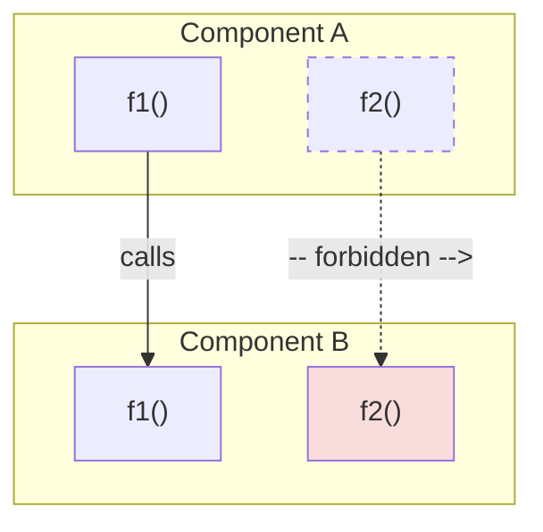
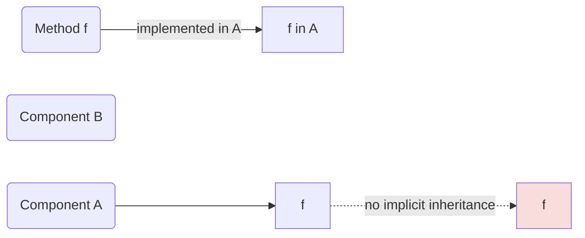

# Type

## Abstract
This document defines **Type** as a foundational modeling concept: a first-class semantic entity with an explicit identity and a defined contract. The definition is given independently of any specific language — it describes what Type *means* as a modeling decision, not what a compiler requires. A Type represents a named concept in the domain model; its identity is nominal and its purpose is semantic, not structural. This understanding of Type has found concrete expression in the Khayyam programming language, where every type — whether it owns state (Capsule), defines callable behavior (Method), specifies a contract (Abstraction), or delimits a semantic boundary (Scope) — participates in a unified type model derived from these principles. See [Guide](#how-to-identify-a-type-in-the-domain) for a practical decision framework.

## Introduction

### Motivation
In most programming languages, the word "type" serves the compiler's need to classify data: how many bytes, what layout, which operations are valid. This instrumental view is necessary for machine execution but insufficient for system modeling. When type is reduced to an implementation artifact, the result is what Evans calls the "Anemic Domain Model" — data structures stripped of behavioral meaning, with logic scattered across service layers that the type system cannot verify or enforce.

The concept of Type, before it becomes a language construct, is a modeling concept. It answers the question: "What things in this domain have independent identity and meaning?" This question exists regardless of whether a compiler is present. A domain modeler deciding that "Contract" is a distinct concept from "Document" is making a Type decision — the compiler merely records it.

This document defines Type at that modeling level first, then shows how Khayyam's type system is a concrete realization of these principles. The separation is deliberate: the definition should remain valid even if Khayyam's syntax changes, because it describes a concept, not a syntax.

### Type Beyond Programming Languages
Type, as defined in this document, is not introduced by programming languages. A language is one mechanism for expressing Types, not the reason Types exist. A Type exists wherever a system distinguishes one meaningful category of entity from another — a domain model, a business process, a protocol, or an organizational structure can contain Types even where no source code exists to represent them. Khayyam does not create the existence of Types; it provides a language for expressing a distinction that already holds at the modeling level.

In practice, the correlation between Type and Khayyam is strong, because Khayyam is currently the first and most concrete realization of these principles — most readers will encounter Type through Khayyam's syntax before encountering it as an abstract modeling concept. That correlation is a fact about where this document's principles are first put into practice; it is not a claim about where Type originates. The [Definition of Type](#definition-of-type) below is written to hold independently of Khayyam, and [Manifestation in Khayyam](#manifestation-in-khayyam) exists as a separate section specifically to keep that boundary visible: principles first, language second.

### Methodology
This document was developed through analysis of existing documents in the Memar project — particularly Modeling, Encapsulation, Abstraction, Inheritance, and Polymorphism — to extract the common concept that underlies them all. The analysis attempted to avoid presuppositions about what Type should be, instead deriving its properties from the principles and decisions already established across these companion documents. Where a claim about Type depends on a specific decision already recorded elsewhere, that dependency is made explicit through a direct link to the companion document rather than restated. Where the evidence from companion documents was insufficient to justify a definitive claim, the question is recorded as unresolved rather than assumed.

## Explanation

### How to identify a Type in the domain
Not every concept in a domain should become a Type. The following framework provides practical guidance for the modeling decision.

**Should be a Type** when the concept:
- Has independent identity in the domain — domain experts name and reason about it separately.
- Has its own lifecycle — it can be defined, composed, specialized, and evolved independently.
- Has rules or invariants that belong to it specifically.
- Participates in relationships where it is an endpoint with its own identity.

**Should NOT be a Type** when the concept fails these criteria — see [What Is Not a Type](#what-is-not-a-type) for the detailed catalog of exclusions and examples.

**The gray zone**: Some concepts fall where reasonable modelers disagree. The modeling document addresses this directly: an abstraction is justified by an autonomous responsibility and lifecycle, not by the existence of data. A concept may justify an independent Type only when it represents an autonomous concern with its own rules, behavior, lifecycle, validation requirements, or architectural responsibilities. The mere ability to assign a name to something does not automatically justify introducing a separate Type. This criterion — derived from modeling.md's "Concept Existence vs. Model Existence" principle — provides the boundary: the gray zone is resolved by asking not "can we name this?" but "does this carry an independent responsibility?"

**A note on lifecycle**: The term "lifecycle" in this framework does not exclusively mean runtime creation and destruction (create, persist, destroy). For some Type categories — particularly Method — lifecycle encompasses the stages of definition, composition, specialization, and execution. A Method is defined with a signature, composed with other Methods or Types, specialized through receiver attachment, and executed when invoked. These stages constitute a lifecycle, even though a Method is not "created" or "destroyed" in the same way a Capsule instance is. The framework applies across categories when lifecycle is understood at this level of generality.

**A note on independent identity**: "Independent identity" is a claim about meaning, not about unconstrained existence, and the two are easily conflated. A concept has independent identity when it is named and reasoned about on its own terms — not when it can exist free of any containing context. A parameter has an identity distinct from the Method that declares it (a `Person` parameter is still recognized and reasoned about as `Person`), even though the parameter cannot exist outside that Method's signature. The same reasoning applies to any Type category whose current usage places it inside another construct: containment constrains where the concept may appear, not what the concept means. This distinction matters when applying the framework to categories such as Scope — see [Scope](#scope--type-as-semantic-boundary).

### Definition of Type
A **Type** is a first-class modeled entity with an explicit identity and a defined contract.

**First-class** means Types are named, referable, and composable — they participate in the model as entities that can be passed, referenced, and related, not merely as internal classifications.

**Modeled entity** means a Type exists because of a modeling decision, not because an implementation requires a data classification. The modeling decision identifies something in the domain that has independent identity and meaning. This does not mean every Type must correspond to a physical object — `Order` is a Type even though orders are administrative constructs — but it must correspond to a concept that domain participants recognize, name, and reason about.

**Explicit identity** means a Type has a name and a boundary that distinguish it from other Types, even those with similar structure. This is a nominal position: two Types with identical structure but different names represent different concepts. The implications of this choice are examined in [Type Identity](#type-identity).

**Defined contract** means a Type specifies what it guarantees — its operations, its rules, its valid states, and its relationships — without necessarily specifying how those guarantees are realized. The contract is the interface between the Type's semantic identity and its concrete manifestations.

A Type may contain:

- **Identity**: The name and boundary that distinguish this Type from others.
- **Behavior**: Operations the Type supports, defined by their semantics.
- **Rules**: Constraints, invariants, and behavioral guards. See [Type and Rules](#type-and-rules).
- **Relations**: Connections to other Types. Whether a given Relation itself warrants becoming a Type is a modeling-layer decision made using the same criteria as any other Type — see [Type and Relations](#type-and-relations).
- **Constraints**: Restrictions on valid values or relationships across instances.
- **Documentation**: Knowledge artifacts that support understanding.

#### What Is Not a Type
The definition above establishes the inclusive boundary of Type — what qualifies. An equally important function is the exclusive boundary: what does *not* qualify, even though it may be named, useful, or present in the domain model. This section is the detailed counterpart to the negative criteria introduced in [How to identify a Type](#how-to-identify-a-type-in-the-domain) — it is not a separate set of rules, but the same boundary worked out through concrete categories and examples.

The following are **not** Types:

- **Attributes and values**: A person's age, a product's price, an order's status — these are properties that belong to a Type, not Types in their own right. They derive their meaning from the Type they belong to, and they have no independent identity or contract. This holds unless the domain model explicitly elevates one of these to an independent concern — for example, `Money` may be a Type with its own rules (rounding, currency conversion) even though it functions as a value in many contexts.

- **Implementation mechanisms**: Garbage collection strategies, memory layouts, dispatch tables, serialization formats — these are how Types are realized, not Types themselves. They serve the implementation, not the domain model.

- **Runtime infrastructure**: Threads, sockets, file handles, message queues — these are platform artifacts that a Type may reference or wrap, but they are not Types unless the domain model gives them independent identity and contract. A `Connection` capsule that wraps a socket with domain-specific rules is a Type; the raw socket handle is not.

- **Organizational structures**: Modules, packages, namespaces, directories — these organize Types but are not themselves Types. They are grouping mechanisms that exist for navigation and access control, not for domain modeling.

- **Transient computational states**: Loop counters, intermediate calculation results, temporary buffers — these exist during computation but carry no domain meaning. They are artifacts of execution, not of modeling.

The exclusive boundary matters because Type is a foundational concept, but not every named artifact automatically becomes a Type. The expansion of the Type category should remain conservative: a concept should be admitted as a Type only when the modeling justification — independent identity, autonomous responsibility, defined contract — is clear. Admitting too many concepts as Types dilutes the category, making it progressively harder to distinguish what is architecturally significant from what is merely named. The history of Object-Oriented Programming provides a cautionary parallel: the concept of "Object" once had a clear meaning, but was gradually overloaded to encompass data, behavior, identity, namespace, module, service, and factory — until it became so broad that it lost discriminating power. The Type concept should not follow that trajectory.

### Type Identity
A Type's identity is **nominal** — it derives from the Type's declared name within a bounded context, not from its structure.

Two Types with identical structure but different names are different Types because they represent different concepts. `Age` and `Height` may both be represented as integers, but they are different Types because they mean different things.

Conversely, two Types with different structures but the same name in the same bounded context represent a modeling conflict, not two valid Types. The name, within a context, uniquely identifies the concept.

**Contextual scoping**: The concept "Customer" in a billing context is not the same concept as "Customer" in a shipping context, even though they share a name. A type system must provide a mechanism — modules, namespaces, or explicit context declarations — to scope Type identity.

**The nominal enforcement requirement**: If `Age` and `Height` are nominally distinct Types, the type system must prevent their conflation — you cannot pass an `Age` where a `Height` is expected, even though both share the same representation. If the type system cannot observe this distinction, nominal identity is merely a naming convention, not a semantic property.

**Interaction with structural satisfaction**: A language may realize Abstraction conformance structurally — a Capsule satisfies an Abstraction when it implements all required methods with matching signatures, without an explicit implementation keyword. Structural satisfaction introduces a tension with nominal identity at the Abstraction layer: a Capsule might accidentally satisfy an Abstraction it was never intended to implement (Go's well-known accidental satisfaction problem). Whether that risk warrants a mitigation mechanism is a language-design question, owned where the conformance mechanism itself is defined. The Type Identity principle stated here — nominal identity within a context — applies at the declaration level; structural satisfaction operates at the conformance level. The two are not contradictory, but their interaction requires careful design.

### Type vs Implementation Type
A programming language type is one possible representation of a modeling Type. They are not the same thing, and conflating them causes two distinct problems:

**The descent problem**: A single modeling Type may have multiple valid implementation representations. A `Person` Type might be stored as a row in a relational database, a document in a document store, or an object in memory. If the modeling Type is defined by its implementation, it cannot be represented differently in different contexts without losing its identity.

**The ascent problem**: A single implementation type may represent multiple modeling Types. An `int32` can represent an `Age`, a `Height`, a `Temperature`, or a `Quantity` — each of which is a different modeling Type. If the implementation type defines the modeling Type, these distinctions are lost.

The modeling Type is primary; the implementation type is secondary. The mapping from modeling Type to implementation type is a design decision, not an identity. However, this creates a gap that must be bridged: if the modeling Type exists at a different level, there must be a mechanism for mapping between them. This mechanism is not specified here — it is a concern of the language that realizes these principles.

#### Stateless Types
**Identity belongs to the type system.** The answer to "which concept is this?" MUST be determinable from the Type alone — at compile time, by the type checker — never by inspecting runtime data. The framework, as the architectural authority over the language ([Framework](./framework.md)), assigns identity to the type system's responsibilities; data's role is variation between instances of the same concept, not distinction between concepts. Every value in a realized system serves exactly one of three roles, and each role has exactly one home:

| Responsibility | Home | Verifiable at |
|---|---|---|
| Identity — which concept is this? | The type system (the Type itself) | Compile time |
| Behavior — what can it do? | Methods on the Type | Signature at compile time, execution at runtime |
| Data — what values does this instance carry? | Instance state (fields) | Runtime |

Confusing the roles forces one mechanism to simulate another: identity simulated as data cannot be checked at compile time, behavior simulated as data cannot vary between instances, and data simulated in signatures cannot be expressed in contracts.

Modeling justifies a Type by independent responsibility, not by the presence of data (see [How to identify a Type](#how-to-identify-a-type-in-the-domain)). It follows that a concept carrying no per-instance state — every distinguishable fact about it fixed at definition time — is still a Type whenever domain participants name and reason about it on its own terms: a failure condition (`ErrNotFound`), a permission (`PermissionDeleteAccount`), a lifecycle status (`StatusArchived`). Nominal identity then imposes a hard requirement on any realization: each such Type MUST be carried as its own named entity. The requirement is not arbitrary — a static concept has no per-instance data in which identity could meaningfully live, so the Type itself is the only identity mechanism left; demoting it to runtime data inside a shared container leaves nothing else answering "which concept is this?". Representing such concepts as a name field, tag value, or string constant within one generic implementation type (for example, a generic error capsule initialized with `"ErrNotFound"`) is the ascent problem in its most consequential form — a single implementation type silently standing in for many modeling Types — and it demotes identity checks from compile time to runtime value comparison, outside the type system's guarantees entirely.

Two boundary clauses complete the rule. First, the converse guards against over-splitting: where instances of *one* Type vary, that variation is data — fields on the Type's realization — not new Types. Second, neither structural similarity nor structural difference between realizations creates or dissolves Type identity; both questions were settled at the modeling layer (see [Type Identity](#type-identity)). Family resemblance to known static-concept families (errors, capability identifiers, status codes) is likewise not itself a qualification — each candidate still passes through the modeling test, and a status label that carries no independent responsibility remains an attribute of its owning concept, not a Type of its own.

Java assigns each failure concept its own exception class — the closest mainstream validation of type-per-concept identity. Its weaknesses lie in the exception mechanism Memar rejects (implicit stack unwinding, catch blocks at arbitrary distance), not in the identity model; its checked-exception contract burden, however, previews the API-surface cost noted above. Rust and Swift group failure concepts as enum variants within error types: identity sits in a runtime tag rather than in the Type itself, a trade-off they accept in exchange for exhaustiveness checking over grouped failure families. More broadly, across language communities whose official philosophy rejects type-level identity, practice drifts toward it anyway — developers define custom types once sentinel strings prove insufficient, lint rules emerge to distinguish identity-as-data from identity-as-Type, and richer comparison mechanisms approximate what the type system would have provided natively. That drift is evidence the need is real and widespread; the memar-go companion analysis documents it in depth for the Go ecosystem.

### Categories of Type
The Type concept manifests through distinct categories that represent different semantic roles. These categories are not subtypes of each other — they are different ways a Type can fulfill its role in the domain model.

#### Type Categories Are Not a Hierarchy
The categories defined within the Type model should not be interpreted as an inheritance tree or taxonomic hierarchy.

A Capsule is not a specialization of an Abstraction. An Abstraction is not a specialization of a Method. A Method is not a specialization of a Scope. Each category exists because it fulfills a distinct semantic role within the language model.

Relationships between categories are expressed through participation, ownership, visibility, composition, satisfaction, or other semantic connections — not through parent-child classification.

This distinction is important because traditional programming languages often organize concepts into rigid hierarchies. The Type model instead treats categories as independent concepts connected through explicit semantic relationships.

Understanding a category should not require understanding its position in a hierarchy. Each category must remain meaningful and well-defined in isolation.

This principle — graph of semantic relationships, not inheritance hierarchy — extends beyond the Type model. It reflects a foundational modeling decision: concepts are connected through explicit semantic roles, not through taxonomic classification. This same principle is expected to apply across the broader Memar modeling framework and is likely to be reflected in companion documents such as [Modeling](./modeling.md) and [Terminology](./terminology.md).

#### Capsule — Type with Owned State
A Capsule is a Type that owns state and the behavior that operates on it.

"Owned state" means the Capsule is responsible for the lifecycle and integrity of its data. It controls access to its state and ensures that all modifications preserve its rules. This is ownership in the semantic sense: the Capsule is the authoritative source of truth for the state it contains.

"Behavior" means the Capsule provides operations that reflect the Type's semantics. A `BankAccount` Capsule does not merely store a balance — it provides `deposit` and `withdraw` operations that enforce business rules. The behavior is part of the Type's contract, not an implementation detail.

#### Method — Type as Callable Behavior
A Method is a Type that represents executable behavior. It is not a separate concept from Type — it is a Type whose primary semantic role is to be callable.

This is a departure from most languages where functions are not types. In this document's model, a Method is a callable entity: it has an identity, a contract (its signature), and it participates in the type system like any other Type. A method can be attached to any Type — a Capsule, an Abstraction, or even another Method.

Methods are Types not because they contain executable code, but because they represent first-class semantic entities within the language model. Higher-level concepts such as rules, workflows, vouchers, policies, and campaigns are ultimately expressed through method structures and compositions. A `Voucher` rule that applies a discount to an invoice and adjusts a campaign balance is, at the level of the language, a Method (or composition of Methods) attached to the relevant Types. The Method category provides the fundamental semantic building block through which these higher-level domain concepts are realized.

This is what separates a Method from an ordinary expression or statement inside a method body: an expression has no existence outside the body that contains it, while a Method has its own signature, can be imported across files, attached to a receiver independently of where it was originally defined, and composed with other Methods as a named, referenceable unit. It is this independent, referenceable existence — not merely the presence of executable code — that qualifies Method as a Type category rather than an internal language mechanism.

The key implications:
- Methods can be imported, referenced, and composed like any other Type.
- A method's contract includes its receiver type, its efficacy (output) variables, and its impressible (input) variables.
- Methods without a `self` reference are type-level (static) behaviors; methods with `self` are instance-level behaviors. This distinction is governed by the presence of `self` in the signature, not by a separate keyword.
- Body-less methods serve two purposes: defining the required signature for an Abstraction (contract), or signaling FFI (the implementation will be provided externally during linking).
- A Method can carry other Methods — one method may compose or delegate to others, forming executable behavior trees.

**Method lifecycle**: A Method has a lifecycle that encompasses definition (signature declaration), composition (attachment to a receiver type and combination with other methods), specialization (override or extension in a satisfying capsule), and execution (invocation). This lifecycle is distinct from the instance lifecycle of a Capsule — a Method is not "created" or "destroyed" at runtime in the same sense — but it constitutes a genuine lifecycle nonetheless: the Method passes through identifiable stages that affect its identity and behavior within the type model.

The "Method as Type" position has consequences for the composition of categories: since methods are types, they are currently the primary mechanism through which capsules satisfy abstractions. An Abstraction specifies which methods must exist; a Capsule provides their implementations. The method itself, as a Type, is the unit of composition. Whether Methods are the *only* such mechanism, or whether other constructs (Relations, Protocols) may serve comparable bridging roles in the future, remains an open question. This is why the Inheritance document can state that "behavior transfer between capsules is rejected" while "abstraction extension (inheritance of requirements) is supported" — the method, as a Type, is the unit that connects the two categories as currently modeled.

#### Abstraction — Type as Contract
An Abstraction is a Type-level contract without owning state or behavior.

An Abstraction specifies what operations a Type must support, but not how those operations are implemented or what data they operate on. It defines pure intent. Methods that fulfill an Abstraction's contract are defined independently — they are separate Types, not embedded within the Abstraction.

An Abstraction can compose other Abstractions, building compound contracts from simpler ones. This is the mechanism for inheritance between abstractions: when Abstraction B includes Abstraction A, B extends the set of requirements — no behavior is transferred, only requirements flow. This distinction between requirement extension and behavior transfer is fundamental.

Abstractions must use other Abstractions as their arguments and return types — not Capsules — preserving the contract-level abstraction boundary. This ensures that an Abstraction's contract is entirely implementation-agnostic.

Crucially, Abstractions do not contain predefined method bodies. They are pure contracts. Default implementations (as in Rust traits or Java `default` interface methods) are explicitly rejected — they blur the line between contract and implementation, and introduce implicit behavior routing that contradicts the principle of Explicit Behavior Ownership. This maintains a clean separation: Abstractions define *what*, Capsules define *how*, and Methods are currently the primary mechanism connecting them.

A Capsule satisfies an Abstraction through implicit structural satisfaction: if a Capsule implements all required methods with matching signatures, it conforms, without an explicit `impl` keyword. The compiler validates this at the point where the abstraction type is expected.

#### Scope — Type as Semantic Boundary
A Scope is a Type that delimits a semantic boundary within which names, relationships, ownership rules, and visibility constraints are established.

A Scope is not merely a syntactic block. It defines what is visible, what is accessible, what is owned, and what is isolated within its boundary — properties determined by the Scope's own naming rules, visibility rules, and entry/exit semantics, not by whatever construct currently contains it (see [A note on independent identity](#how-to-identify-a-type-in-the-domain)). Many higher-level constructs can be modeled as specialized forms of Scope rather than independent language primitives: a namespace, a module's visibility boundary, a package boundary, a transaction's isolation boundary, and a local algorithmic block (as used by `if`, `loop`, `goto`) are all instances of the same fundamental concept — a bounded region with its own naming, access, and composition rules.

Khayyam's current syntax places scopes inside method bodies to express algorithmic control flow, and its examples reflect that usage. This is a placement rule enforced at the language and tooling layer, not a defining property of Scope itself: nothing in the semantic-boundary definition above requires a Scope to be nested inside a Method, and namespace- or module-level boundaries are realizations of the same category that are not nested inside any Method. Where Khayyam's syntax permits or restricts Scope's placement is a language-design question for the Khayyam specification and its governing linters — see [khayyam.md](./khayyam/khayyam.md) — not a claim this document makes about what a Scope is.

The decision to treat Scope as a Type category reflects the principle that language constructs which establish independent semantic boundaries deserve first-class treatment in the type model. If Scope were merely a compiler-level syntactic convenience with no semantic significance, it would not qualify as a Type. The fact that it governs visibility, ownership, composition, and isolation — all of which are semantic properties — justifies its inclusion.

#### The Relationships Between Categories
All four categories — Capsule, Method, Abstraction, Scope — are equally direct realizations of Type; none is nested inside another as a subtype. What connects them is a set of named, cross-cutting relations, not a shared ancestor:

| Relation | From → To | Nature |
|---|---|---|
| satisfies | Capsule → Abstraction | implicit structural conformance |
| attaches to | Method → Capsule / Abstraction / Method | receiver binding |
| extends | Abstraction → Abstraction | requirement inclusion, no behavior transfer |
| commonly used within | Scope → Method | current Khayyam usage pattern, not a containment requirement (see [Scope](#scope--type-as-semantic-boundary)) |

These categories share the foundational properties of Type — identity, contract, and composability — but differ in what they own and what role they play. The key relationships:

- **Method currently connects Capsule and Abstraction**: An Abstraction declares required methods; a Capsule provides their implementations. The method is the unit of composition — it is what Abstractions require and what Capsules provide. Whether this is the sole bridging mechanism, or whether other constructs may serve comparable roles in the future, remains open.
- **Capsule satisfies Abstraction**: Through implicit structural satisfaction — the Capsule implements all required methods with matching signatures.
- **Abstraction extends Abstraction**: Via inclusion, requirements flow without behavior transfer. This is inheritance in its correct sense.
- **Capsule never inherits from Capsule**: Behavior transfer between capsules is rejected. The alternative is explicit delegation — the developer writes a method on the host capsule that visibly forwards the call to an embedded instance.
- **Scope commonly appears within Method**: In current Khayyam usage, scopes structure execution and define semantic boundaries inside method bodies — a usage pattern, not a requirement of the Scope category itself.
- **Method can attach to any Type**: Not only Capsules — methods can be defined on Abstractions (defining the required signature) and on other Methods.

None of these categories is a subtype of another. They are different semantic roles fulfilled by the same foundational concept: Type.

#### Why Only Four Categories?
Not every concept that participates in the Type model earns its own category. A Type category is justified only when it represents a fundamental semantic role that cannot be expressed as a specialization, composition, or usage pattern of a category that already exists. Capsule (owns state), Method (callable behavior), Abstraction (pure contract), and Scope (semantic boundary) are currently considered to meet this bar — each governs a role none of the other three governs.

Concepts such as Rule, Relation, Protocol, Workflow, and Policy depend on Types, and some of them may themselves warrant becoming Types (see [How to identify a Type](#how-to-identify-a-type-in-the-domain)) — but they do not, at present, justify a distinct *category* within the Type model, because their behavior is currently expressible through composition of Capsule, Method, and Abstraction. The Rule/Voucher example in [Method as Type](#method--type-as-callable-behavior) illustrates this: a Voucher is not a fifth category, it is a composition of Methods attached to relevant Types.

This boundary is deliberately conservative, for the reason argued in [What Is Not a Type](#what-is-not-a-type): admitting a new category too readily risks the same dilution that made "Object" in OOP progressively meaningless. Should a future concept prove genuinely irreducible to the existing four roles, introducing a fifth category is not ruled out — but the burden of proof sits with demonstrating irreducibility, not with defending the current count.

#### Type Categories vs Language Keywords
Other languages introduce many more top-level constructs than Khayyam does — `struct`, `class`, `record`, `union`, `interface`, `trait`, `namespace`, `module`, `package`, `enum`, `concept`, among others. This is not evidence that Khayyam's model is incomplete; it reflects a different premise. The existence of a dedicated keyword in another language does not imply the existence of a distinct foundational concept. Several of the most common keywords above are, on inspection, specific realizations of a category this document already covers:

| Common keyword elsewhere | Typical role | Khayyam category |
|---|---|---|
| `struct`, `class`, `record`, `entity`, `value object` | owns state and behavior | Capsule |
| `interface`, `trait`, `contract`, `concept` | pure contract | Abstraction |
| `function`, `procedure`, `routine`, `handler` | callable behavior | Method |
| `namespace`, `module`, `package` | boundary of visibility, ownership, or isolation | Scope |

This mapping is not exhaustive and not a claim that every keyword in every language reduces cleanly to one of these four roles. A construct like `union`, for instance, is arguably closer to an implementation strategy for representing overlapping state than to a modeling role, and this document takes no position on it. The claim is narrower and specific to the rows above: where a construct's role is owning state, defining a pure contract, providing callable behavior, or establishing a visibility/ownership boundary, Khayyam expresses it through the corresponding Type category rather than through a dedicated keyword of its own.

Rust's struct/trait distinction parallels Capsule/Abstraction, but Rust treats functions as separate from the type system. OCaml's structure/signature distinction is similar but also separates functions from types. Khayyam's "Method as Type" is a genuinely different position — closer to Smalltalk's "everything is an object" but with explicit type categories rather than a single uniform concept.

### Type Metadata
Types accumulate auxiliary concerns beyond their core contract — access to state and to invoked behavior, implementation intent visible to tooling, human-facing names and documentation across languages. This section records three such families because they recur constantly; it does not claim they are the only ones, and new families are expected. Every family receives the same treatment regardless: its carrying answer is chosen between ordinary first-class constructs and companion artifacts — never new declaration keywords on the language surface. Each family below states the concern, the carrying answer, and why the keyword route was rejected.

#### Access
Whether for state or for behavior, access expectations are part of the Type's own definition. Encapsulation by construction keeps everything inside a Type's boundary inaccessible from outside; interaction happens through the Type's methods, and each method governs the level at which it permits invocation — a behavior may be callable broadly or restricted to specific callers, exactly as a field may be exposed or held internal. A declaration keyword like `private` therefore adds nothing the model lacks: it restates structurally enforced facts at the language surface, and worse, its existence implies that openness were the default requiring explicit closure — when this framework's default is precisely the opposite. Every member being internal unless deliberately exposed is not a modifier to declare; it is the standing rule of the boundary itself.

#### Implementation intent
Types under active development often need tooling assistance before they are complete: generating repetitive members against an Abstraction's requirements, reviewing partial progress, or reserving a contract slot ahead of implementation. Structural conformance alone cannot provide this signal — an unfinished Type does not yet satisfy anything, so there is nothing for a tool to detect. The framework's answer is an ordinary first-class construct: the Type composes an intent-declaring Abstraction or exposes a plainly named Method announcing which Abstraction it targets, giving tools a uniform, discoverable marker ahead of completion.

Requirements of this kind vary by circumstance and multiply quickly — one effort needs pre-completion signals, another wants completeness checking, another wants capability tagging — so folding them into syntax taxes every reader of the language to serve whichever family arrived first: the coloring cost of a crowded surface. Recorded precedent adds a second rejection ground: keyword/marker routes add ceremony without stronger guarantees than plain constructs, because a deliberate actor can misstate intent through a keyword exactly as easily as through a method — the syntax buys restriction in name only.

#### Human-facing identity
Where software is multilingual — or consumed across programming languages through generated bindings — a Type's identity does not stop at its functional contract. Its localized names, UI labels, human-readable documentation, and localized descriptions of its behaviors and failures belong to the Type itself.

The pathology this refuses is familiar. A single concept ends up described in four disconnected places: its behavior in one layer, its validation re-expressed in another, its display strings in translation files keyed by string lookup somewhere else entirely. Each copy drifts on its own schedule; interfaces desynchronize from types, boilerplate accumulates with every new consumer, and the single source of truth quietly dies while every party believes they hold it. This framework attaches the whole stack to the Type instead: human-facing metadata lives in companion artifacts kept beside the Type's definition — one per required language, sharing a common base name qualified by the target language — so the functional definition remains uncluttered while the association stays mechanical rather than merely conventional.

Because these artifacts are first-class parts of the Type's definition, consumers do not maintain parallel mappings: presentation layers, gateways, and generated bindings query the metadata directly from where it lives, and localized text reaches the end user driven by the type system itself — zero-redundancy alignment between what the system is and what the user sees. Downstream programming languages receive the same identity through generated output from that one source; adding a second implementation language means regenerating, not re-translating. External translation files keyed by string lookup are rejected as the direct cause of the fragmentation above, not merely a less convenient alternative — the same reasoning that distinguishes this from annotation-based localization schemes, which tie strings to classes yet still leave them external resources resolved by lookup rather than first-class parts of the definition.

A real cost is accepted knowingly: tight coupling means even a wording tweak by a non-developer translator touches files living beside source definitions. Tooling and workflow must therefore treat companion artifacts as safely editable outside full development environments, so translation work never requires developer round-trips nor risks the functional definition.

The pattern across the recorded families is deliberate and generalizes: metadata requirements are circumstance-dependent, open-ended, and specific to each family, while syntax is closed and shared by everyone. When a family not covered here appears, the question is never "what keyword should express this?" but "which explicit carrier fits it — a first-class construct or a companion artifact?". Metadata is content; the language surface stays minimal.

### Type and Modeling
Because Types represent semantic entities, defining a Type is a modeling decision rather than merely a programming decision.

A Type should correspond to a meaningful concept in the domain model, not simply to a convenient collection of data fields. Before defining Types, the modeler must identify the concepts, boundaries, identities, and relationships that exist in the modeled reality. A Type is the result of correct modeling, not a replacement for the modeling process. This document depends on the principles defined in [Modeling](./modeling.md), especially the "Modeling Before Implementation" principle.

The modeling document establishes that the output of modeling is a set of abstractions, concerns, relationships, and supporting documents — not capsules. Capsules are implementation-level realizations. This means the modeling phase identifies Types at the Abstraction level first; the Capsule level comes later, during architecture and implementation. The Type concept spans both levels, but the modeling decision that justifies a Type's existence operates at the Abstraction level.

Ownership flows one way across these levels. Modeling identifies a concept and its boundary; the Type represents that concept and becomes the boundary behavior hangs from; implementation-level principles — Explicit Behavior Ownership, [below](#explicit-behavior-ownership) — preserve that boundary rather than replace the modeling that produced it. When a behavior's ownership is ambiguous in code, the root cause usually lies upstream: a modeling step that failed to identify the correct Type for the concept. Ambiguity discovered at implementation time is therefore a modeling defect surfacing, not an implementation problem to patch locally.

### Explicit Behavior Ownership

Memar enforces the principle **Single Visible Ownership of Behavior**: every action (method) has exactly one clear, discoverable owner, and no behavior is inherited, promoted, injected, or synthesized without being spelled out in source code. This principle — **Explicit Behavior Ownership (EBO)** — states that only explicitly-defined or explicitly-delegated methods count as behavior of an entity. Any feature that implicitly adds behavior is rejected: inheritance, trait default implementations, implementation embedding (an inner component's methods silently appearing on the outer component), method promotion, compiler synthesis, and opaque macro expansion. Protocol extension is unaffected: it transfers declarative requirements, never behavioral implementations. All behavior sharing must be explicit and visible.

Formally: for every method `m` present in a component `C`, one of two conditions must hold —

1. `C`'s source code explicitly defines `m`; or
2. `C`'s source code contains an explicit delegation call naming another component's method (`other.m(...)`).

No other mechanism may introduce `m` into `C`: no implicit copy or aliasing across components; no acquisition through inheritance, embedding, or macro expansion unless the expansion exists verbatim in source under the developer's control; and protocol extension is not behavior acquisition at all, so it stands outside this rule entirely.

Three questions must have direct, local answers when reading any component: **Where was this behavior defined? Why is it available here? Who owns it?** If any answer requires traversing an inheritance hierarchy, mentally executing a macro, or consulting documentation beyond the source itself, visibility has failed. Navigating elsewhere to study a delegation *target's* internals is fine — the three answers come locally from the explicit call; navigation is for depth, not discovery.

Delegation is the mechanism by which behavior is shared under EBO, and its goal is not reuse in the traditional sense but **visibility**: when component A delegates to B, A's source contains a visible call to B's method, so readers of A see *what* is delegated (name and signature), *where* it goes (the target), and *why* (the surrounding logic explaining the decision). Inheritance offers none of these locally. Each method node belongs to exactly one owner, and every call edge is written in source — making the behavior graph explicit, inspectable, and acyclic by construction: one cannot accidentally create ownership loops, and no method can be traced back to two authoritative sources. The ownership graph is a tree (or forest), never a multi-parent DAG.

#### How Behavior Hides

Modern platforms offer many mechanisms that let behavior appear in a component without being defined there. They are often grouped under the label "inheritance," but they are independent solutions to a legitimate problem — boilerplate reduction — which happen to share one property: **ownership ambiguity**. The catalog:

- **Classical inheritance:** a base-class method appears in all descendants with no code in the descendant.
- **Trait default implementations:** implementing a type acquires a provided body without writing it.
- **Method promotion (embedding):** embedding a type makes the inner type's methods available on the outer one.
- **Compiler synthesis:** generated members (`equals`, `hashCode`) appear unwritten.
- **Generated implicit methods:** generators create methods present in the binary but absent from the source the developer reads.
- **Macro expansion:** a macro call expands into method definitions invisible before expansion.
- **Automatic delegation:** frameworks or runtimes silently forward calls to embedded or wrapped objects.

Each introduces a hidden edge in the behavior graph: a method exists in a component whose source does not show why. A recurring lesson from debates over these mechanisms is that the arguments are rarely about the mechanisms themselves — they are about **ownership** (who is responsible?), **visibility** (where does it come from?), **discoverability** (how do I find it?), and **structural relationships** (what is the real relationship between these components?). By answering those directly instead of adjudicating which "type of inheritance" is acceptable, the underlying problem resolves without engaging a taxonomy whose subject may not exist. EBO categorizes nothing and restricts no specific mechanism; it states the positive rule — behavior must have a visible owner — and lets consequences follow.

#### "Inheritance" Is a Borrowed Metaphor — With No Subject Here

A deeper observation concerns the conceptual model that makes hidden-behavior mechanisms seem natural. The word "inheritance" was not coined by software engineering, and tracing the borrowing illuminates why it carries implications that do not serve software design.

In law (*hereditas*, Roman law; *farāʾiḍ*, Islamic inheritance law whose mathematically fixed shares differ sharply from both Roman and common-law traditions; common-law testamental freedom vs. civil-law forced heirship), inheritance means the transfer of **property or rights** — never capabilities or behavior — and even within law its meaning splits (*successio in personam* vs. *successio in rem*; two fundamentally different transfers unified under one word). . Someone who inherits a piano does not inherit the previous owner's ability to play it.

In genetics, the metaphor's nearest home domain, genes carry instructions for protein synthesis — not behavior. Behavior emerges from gene–environment interactions: epigenetics, neural development, learning, culture. Genetic material comes from **two** parents, not one "base class"; Mendelian inheritance recombines alleles rather than copying traits from a single source. Even Mendel distinguished **genotype** from **phenotype** precisely because inheritance and expression are not the same thing.

Software borrowed the word for principles that genuinely predate OOP — structure reuse, behavior sharing, hierarchical classification — but the biological metaphor carried implications foreign to the actual mechanisms. "Classical" inheritance transfers both structure and behavior from a single parent, a model with no parallel in either home domain. When later languages recognized the tensions, each partial fix required a new term precisely because the original metaphor could not be repaired from within: Go introduced embedding and interfaces — yet embedding still promotes methods implicitly; Rust introduced traits with default implementations — behavior injection under another name. These are independent mechanisms solving boilerplate reduction, each carrying the same cost. None is a "variant" of inheritance.

One software relationship *is* structurally analogous to genetic inheritance: an Abstraction extending another Abstraction. Requirements flow from parent specification to child without the parent being altered, the child building further on top. EBO does not challenge this — what it challenges is the transfer of *behavioral implementations*: bodies, logic, side effects. Extension transfers declarative requirements (signatures, constraints), adding obligations without adding any mechanism for fulfilling them; conforming components write and own every method themselves, visibly. Preferring the term **extension** over "inheritance" is then a terminological choice, not a claim that the structure differs: "inheritance" is so thoroughly associated with behavioral transfer that using it for extension risks importing assumptions that do not apply. The principle matters more than the word — requirements may be extended; behavior must always be explicitly owned.

This also settles the familiar practice of splitting inheritance into "good vs. bad," "interface vs. implementation," "type vs. behavioral": that taxonomy assumes inheritance is one coherent concept with variants. Its home-domain meanings do not apply to behavioral transfer between software components; the labeled mechanisms are independent solutions sharing one cost. Categorizing them is taxonomy without a subject. When two components share behavior under EBO, each defines (or explicitly delegates) it independently, acknowledging similarity through conformance to shared Abstractions — correctly described as extension.

#### Abstractions Stay Pure

Default implementations produce a slow failure mode worth naming: the **death of abstraction**. An Abstraction begins as pure requirements; someone adds a default because "most implementers will want this"; defaults accumulate; the Abstraction stops being an abstraction and becomes an implementation container — a base class in disguise, where implementers wanting different behavior must fight the defaults rather than own their choices. EBO prevents this by forbidding default implementations entirely: Abstractions remain pure, all behavior lives in concrete Types, and code generation is the sanctioned mechanism for easing repeated similar implementations — provided generated code is visible and auditable, living in files developers read rather than compiler intermediates.

A concrete illustration: suppose an `Error` Abstraction declares `is_retryable()`, and a default centralizes retry logic by checking error codes. Who owns the behavior? The Abstraction declared it; concrete types may need to override it; different concrete types may need different logic entirely. With a default, the Abstraction owns the behavior nominally while every diverging implementer fights that ownership — a confused graph with the abstraction and its implementers in implicit conflict. Under EBO the answer is unambiguous: whichever concrete component defines `is_retryable()` owns it; the Abstraction only requires that it exist.

An emerging hypothesis sharpens the intuition: the true owner of a behavior is the component whose source contains its definition — ownership should never be duplicated across entities, because multiple ownership paths recreate ambiguity (if `is_retryable()` traces to both an Abstraction and a concrete Type, neither is authoritative).

#### Generics and Ownership Ambiguity

Generic type parameters (`List<T>`) are not behavior injection in EBO's primary sense: inheritance, trait defaults, and promotion inject bodies where none were written, whereas a type parameter propagates type identity — `List<Connection>` gains no new `Add`; it instantiates an existing one from a template.

But generics introduce a distinct ownership ambiguity with a similar visibility outcome. `Add` is defined in the template `List<T>`; the types that execute it are `List<Connection>`, `List<Service>`. Who owns `List<Connection>.Add()`? The implementation lives in one place; the type that "has" the method is a parameterized instantiation; navigating from use-site to implementation requires understanding the generic substitution system — a real ownership-discovery cost. A developer reading a domain capsule built on `List<Connection>` cannot see `Add`'s behavior in that source at all, failing the visibility test.

A deeper observation follows: generic syntax often becomes necessary not because it is inherently required, but because behavior ownership was already separated from domain concepts upstream in modeling. When "the set of connections managed by this service" is not modeled as its own first-class Type with its own behavior, a generic container becomes the fallback — and the ambiguity is a consequence of that earlier modeling decision, not of generic syntax itself. The Polymorphism document develops this "generics as symptom" argument in detail.

EBO's position: generic syntax is rejected not because parameterization is invalid, but because existing generic mechanisms typically fuse several semantic responsibilities — polymorphism, behavior reuse, compile-time facts, optimization hints — into one mechanism, blurring both behavior ownership and modeling boundaries. The domain-specific alternative — a `ConnectionList` Type defining its own `Add`, directly or via explicit delegation to an internal structure — satisfies EBO completely: every method visible on `ConnectionList` is defined in `ConnectionList`'s source. No hidden edges.

#### The Economics of Explicitness

The standard defense of implicit mechanisms is boilerplate reduction — a framing that treats writing cost as the dominant cost of software. It is not. Consider the lifecycle: a method is written once, then read, understood, debugged, and modified dozens or hundreds of times. If an implicit mechanism cuts writing cost by 20% but raises understanding cost by 30% across fifty subsequent encounters, total cost rises. Maintenance and comprehension dominate the economics, not initial authoring.

Trade-offs here are also mis-framed as binary ("less code but more magic" vs. "more clarity but more verbosity"). The accurate model is opportunity cost: fifteen minutes spent tracing a method through three inheritance layers is fifteen minutes not spent on the actual problem. This holds regardless of reader capability — an experienced developer or a powerful model *can* trace the chain; the question is what else those finite cognitive resources would have produced. Finiteness of processing capacity, human or computational, is a structural property no hardware paradigm removes.

AI participation collapses the traditional trade-off altogether. Development now involves multiple reader-writer classes — humans, linters, compilers, analyzers, generators, AI assistants — and explicit systems serve them all: AI reasons more reliably over visible call origins; static analysis enumerates a component's methods by scanning source, simulating nothing; IDEs document and refactor accurately when ownership is unambiguous; formal verification becomes tractable when the behavior graph has no hidden edges. When AI generates the explicit delegation replacing an inheritance chain, writing cost drops toward zero *and* understanding cost drops structurally — "less code but more magic" versus "more code but more clarity" stops being a choice, because both sides improve. The counterintuitive conclusion: the boilerplate EBO requires is not a cost to mitigate but the very mechanism that makes code legible to every participant, human or machine — exactly as meaningful variable names exist not for the compiler, which needs only addresses, but for every reader that needs to understand.

#### The Ownership Graph

Behavior can be modeled as a directed graph — nodes are components, edges are calls or delegations. Conventional systems fill this graph with implicit inheritance edges; EBO permits only explicit ones:

*Figure: Solid arrow = explicit call/delegation (allowed). Dashed arrow = implicit behavior inheritance (forbidden).*

*Figure: Only explicit method definitions (solid) are counted. The dashed line shows a prohibited implicit transfer of behavior.*

Tooling consequences follow directly from the graph's honesty: compile-time checking enforces that every Abstraction requirement is met by an explicit method in the satisfying component, with no inherited satisfaction; static analysis and compilers enumerate a component's complete method set by scanning source alone; documentation needs no answer to "where did this method come from?" because the source location *is* the answer; AI-assisted analysis and generation gain reliability from fully visible origins; and code generation leverage inverts the old trade-off — AI and linters can scaffold explicit delegations on demand, keeping them auditable and modifiable, so the extra lines become the substrate making automated reasoning more trustworthy rather than a cost automation merely tolerates.

Go interfaces (default-free, aligned with EBO — but embedding implicitly promotes methods, which EBO rejects); Java interfaces pre-8 (pure, aligned — Java 8 default methods moved away); Rust traits (default methods and blanket implementations inject behavior the implementing type's source does not define); C# extension methods (behavior visible in IntelliSense but absent from the type's source); Python and duck typing (monkey patching, multiple inheritance, metaclass manipulation violate ownership clarity in favor of flexibility); C++ multiple inheritance (concrete-body MI creates diamond-ownership ambiguity; the single-owner rule eliminates the class of problem); Ada generics (compile-time composition explicit in instantiation — partially aligned, though resulting behavior remains hard to trace). The common thread: every listed language treats "inheritance" (or its equivalents) as a coherent concept to refine, restrict, or work around. EBO's position is that the concept itself — as a model for behavioral transfer — is what fails examination, not particular implementations.

### Structure Is Fixed by Definition
Memar enforces the principle **a running system executes its definition and never establishes structure**. A system's [Structure](./system.md#structure) — in [System](./system.md)'s sense, the set of capabilities and constraints it exposes and enforces, explicitly not the arrangement of its parts — is established at definition time, carried by the Types the definition declares: in source, accepted by compilation, delivered as the artifact. What a running instance holds are instances: values of defined Types, exercising capabilities the definition established. The instance is not a site of definition — no concept introduction, capability increase, or constraint change can be minted into a running system; every such change is a change to the definition and enters execution only through a new artifact (rebuild/recompilation).

The principle is the structural twin of Explicit Behavior Ownership, above: EBO governs *whose* behavior is visible in source — one owner per method — while this principle governs *when and where* the system's structure may come into being: definition time, in the artifact; never execution time, in the instance. Both draw the same line from the identity model: structure minted at runtime would be structure carried as data — the ascent problem at system scale, with identity ([Stateless Types](#stateless-types)) and capability alike demoted from decided to merely encountered. Configuration and deployment infrastructure carry the same principle one layer out — they are part of what delivers a definition to execution — and their working-out is owned by the framework's protocol documents; this document states the type-level rule they realize, not their own.

Three boundary clauses keep the separation precise. First, **selection is execution**: deferring to runtime the choice among established alternatives — dispatch among a closed set of conforming implementations, branching among compiled paths — is not structural change; the closure was fixed at definition time, and only the value choosing within it is runtime material. Second, **inputs are data**: a runtime value parameterizing defined behavior (user text, request payloads, parameters whose vocabulary is itself a defined Type) exercises the definition; it does not extend it. Third, **platform consumption is not structure acquisition**: a deployed system operates on infrastructure and consumes other systems' services through interfaces its own definition names; what the platform beneath does to serve those calls is that other system's Structure being exercised, not this system's Structure changing. The clauses exclude one thing only — any mechanism whose operation establishes this system's Structure while it runs.

### Type and Rules
A Type may own rules that define valid states and behaviors. Two framings keep this honest. First, a rule exists at the modeling level: it is domain knowledge stated as a constraint or valid-behavior description, and implementation code merely executes it — the checking code is one realization, not the rule itself. Second, ownership follows the concept constrained: rules belong to the Type — or the Relation — that owns the concept they govern, and where a constraint originates outside a resource, Modeling's constraint-ownership principle ([Constraints Belong to the Constraining Concern](./modeling.md#constraints-belong-to-the-constraining-concern)) places it on the constraining concern rather than duplicating it onto each affected party. However, the term "rules" covers several distinct concepts that should be separated:

**Type Invariants** are state properties that must hold for all valid instances of the Type. They can be checked by inspecting a single instance. Example: `balance >= 0`. These correspond to Eiffel's class invariants.

**Constraints** are relational properties that restrict valid values or relationships across multiple instances. They involve more than one instance. Example: "SSN is unique across all Persons." Constraints cannot be checked by inspecting a single instance — they require a broader context.

**Behavioral Rules** govern state transitions — what operations are valid given the current state. Example: "Cannot ship a cancelled Order." These are transition guards, not state properties. They correspond to Eiffel's preconditions and postconditions.

**Business Rules** are domain-specific policies that may vary across deployments, contexts, or time. Example: "Discount cannot exceed 50%." Business rules are often the most volatile category — they change when policies change.

Conflating these categories under a single "rules" concept creates ambiguity. Is "SSN is unique" a rule of the `Person` Type? It involves all Persons, not just one. Is "Discount cannot exceed 50%" a permanent part of the `Order` Type, or a configurable policy? Separating them makes the ownership, checking strategy, and volatility of each explicit.

What Eiffel's Design by Contract teaches: invariants are checked at class boundaries; runtime contract checking is the default because compile-time verification is undecidable in general; and the Liskov Substitution Principle creates a formal relationship between type hierarchies and rule hierarchies.

What dependent and refinement types teach: the strongest possible integration of rules and types dissolves the distinction entirely — a rule *is* a type. This is powerful but comes at high cognitive cost. Refinement types (LiquidHaskell) provide a practical middle ground limited to SMT-decidable predicates.

### Concepts Outlive Their Labels
A recurring failure in the ecosystem's discourse is rejecting a *concept* by rejecting its *label* — discarding the wrapped insight along with the naming tradition it arrived in. The Type model's own position requires the opposite discipline: a concept is judged on what it does for the model, and its prevailing label is only the historical packaging it came in.

The sharpest current case is the functional-programming communities' rejection of object-orientation, which frequently extends to the concepts the OO tradition's vocabulary carries — aggregation, encapsulation, inheritance-as-practiced. The rejection of the vocabulary is understandable: OO's labels arrived bundled with practices worth rejecting (behavior transfer, deep inheritance trees, mutability as default). But the concepts are not the bundle. **Encapsulation, specifically, is not an OO invention that FP may decline — it is a precondition of the Type model itself**: a primitive value that cannot hold its own invariants, that anyone may mutate from anywhere, cannot even serve as the base of a type system. A language without encapsulation cannot define its own `Bool` with the guarantee that it stays `True` or `False`. This is not a hypothetical: the record shows FP-heritage languages growing per-language encapsulation and access-discipline mechanisms as their systems scaled — the concept was declined by name and then re-admitted by need, which is the pattern this document names *concepts outliving their labels*.

The same discipline applies in the other direction, and the framework's own positions exercise it: [Modeling](./modeling.md) rejects the *aggregate-root* pattern while keeping aggregation as a composition outcome; the framework's protocol documents reject the memory/storage dichotomy's *vocabulary* while keeping both retention needs as properties; [khayyam-inheritance](./khayyam/inheritance.md) rejects behavior transfer while keeping requirement extension between abstractions. In every case the test is the same: which concept did this label wrap, does the concept survive independent of the packaging, and what explicitly replaces the packaging's function? A critique that cannot answer the third question has rejected a name, not designed anything.

### Type and Relations
A Relation connects Types to one another, but it is not itself a fifth Type category alongside Capsule, Method, Abstraction, and Scope. A Relation presupposes the existence of the Types it connects — it cannot be defined without them — and so it operates one layer above the concern this document addresses: what qualifies as a Type, and what a Type is made of.

This matters because graph-based domain models — the tool Memar uses for domain discovery, where both Nodes and Edges may carry independent meaning — are *consumers* of Type at a higher modeling layer, not part of Type's own definition. An `Employment` relation between `Person` and `Company` may itself need to become a Type once it has properties like start/end dates or status, but that decision is made using the same criteria as any other Type (see [How to identify a Type](#how-to-identify-a-type-in-the-domain)); it does not require a separate "Relation" category to exist first.

### Manifestation in Khayyam
The principles defined above — Type as semantic entity, nominal identity, four categories of Type, owned rules — have found concrete expression in the Khayyam programming language. This section documents that manifestation without repeating the companion documents; for details, see [Khayyam](./khayyam/khayyam.md) and its companion documents on [Encapsulation](./khayyam/encapsulation.md), [Abstraction](./khayyam/abstraction.md), [Inheritance](./khayyam/inheritance.md), and [Polymorphism](./khayyam/polymorphism.md).

**No primitive types**: Khayyam does not have primitive types. Even values that other languages represent as `int`, `bool`, or `string` are wrapped in named capsules (`W32`, `Bool`, `String`). This is a direct consequence of the "Type as semantic entity" principle: if `Age` and `Height` are different Types, their representation must also be different Types, not shared primitives. This eliminates the ascent problem described in [Type vs Implementation Type](#type-vs-implementation-type) at the language level.

**Sovereign Encapsulation**: all of a Capsule's internal fields are strictly private, and all interaction occurs through method invocation — the owned-rules principle enforced at the language level; see [Encapsulation in Khayyam](./khayyam/encapsulation.md).

**The `tp` keyword**: In Khayyam, every type is declared with `tp`. The keyword is category-agnostic — `tp` declares a Type, and the subtype keyword (`cp`, `mt`, `ab`, `sc`) specifies its category. This reflects the foundational principle that Capsule, Method, Abstraction, and Scope are different realizations of the same concept: Type.

**Method as Type**: Khayyam's `mt` subtype makes methods first-class Types. A method can be imported, attached to any receiver type, and composed through the same mechanisms as Capsules and Abstractions. This is the "Method as callable Type" principle made concrete, and it has no direct precedent in mainstream languages — most treat functions as separate from the type system.

**Abstraction as pure contract**: Khayyam's `ab` subtype defines Abstractions without method bodies. Methods that fulfill an Abstraction's contract are defined independently as separate Types. Satisfaction is implicit and structural — no `impl` keyword. Default implementations are rejected. This maintains the clean separation: Abstractions define *what*, Capsules define *how*, Methods are currently the primary mechanism connecting them.

**Inheritance is between Abstractions**: When an Abstraction includes another Abstraction, requirements are extended — no behavior is transferred. Behavior transfer between Capsules is rejected; explicit delegation is the alternative. This placement of inheritance is a direct consequence of the Type category model: inheritance belongs to the contract layer, not the state layer.

**Behavior over type identity**: Polymorphism in Khayyam operates through abstraction conformance, not through generic type parameters. The question is "what capabilities are required?" not "what concrete type is this?" A method accepting an Abstraction type is, in effect, a universally quantified function over all Types satisfying that Abstraction. Smart Compilation handles the dispatch strategy transparently.

**Sovereign Encapsulation**: All internal fields of a Capsule are strictly private. All interaction occurs via method invocation. Mutability is an intrinsic property of the Capsule's own definition, never a consumer-side keyword. This is the Type principle that identity and contract are declared at the definition site and cannot be bypassed at the call site.
