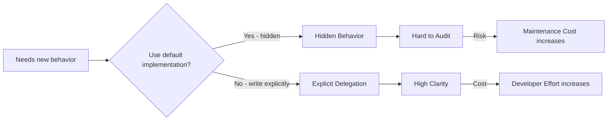
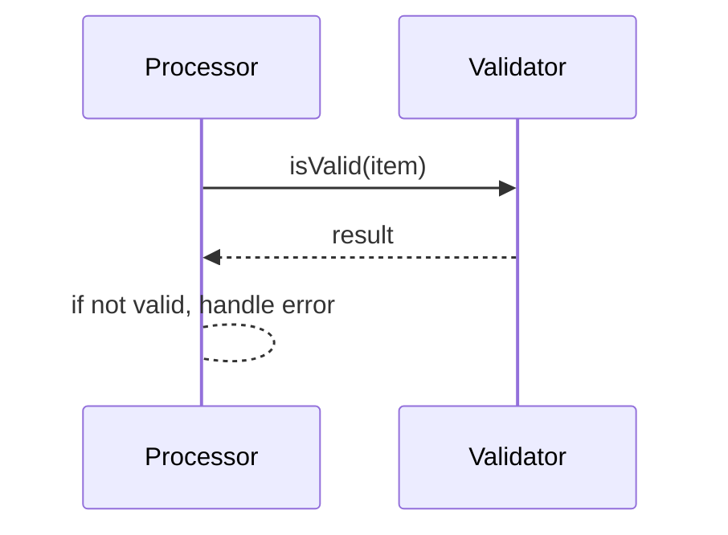

# Type Practice
> **Purpose:** This practice defines how the decisions governed by [type.md](./type.md) are made in practice — the steps and checks an implementer or reviewer runs when turning identified concepts into Types.
> **Nature:** This is a *Practice* — a method commonly used for this type of work, not a claim about knowledge, skill, or capability.

## Route modeling questions first

If the open question is "is this a concept at all, or merely information about another thing?" stop here. That decision belongs to [Modeling](./modeling.md) and its session procedure in [modeling.practice.md](./modeling.practice.md). Family resemblance to known static-concept families (errors, permissions, status codes) never bypasses that test — run it per candidate.

## Qualifying as a Type

A candidate qualifies only if it satisfies type.md's criteria: independent identity named by domain participants, its own lifecycle (definition, composition, specialization, execution — not only runtime create/destroy), rules or invariants that belong to it specifically, and participation in relationships as an endpoint with its own identity. In the gray zone ask "does this carry an independent responsibility?", never "can we name this?". Explicitly reject candidates that are attributes/values of another Type, implementation mechanisms, runtime infrastructure, organizational groupings, or transient computational states. Illustration: two apartments differing only in color are one Type; the ownership relation between an apartment and a person may itself be a Type, because it carries independent meaning.

## Choosing a category

Categories are semantic roles, not a hierarchy:

| If the Type's role is... | Category | Declared with |
|---|---|---|
| owning state + behavior operating on it | Capsule | `cp` |
| callable behavior (first-class) | Method | `mt` |
| pure contract, no bodies, no defaults | Abstraction | `ab` |
| establishing a visibility/ownership/isolation boundary | Scope | `sc` |

Do not justify a fifth category unless the candidate role is irreducible to specialization, composition, or usage pattern of these four. A keyword in another language (`struct`, `trait`, `namespace`, ...) does not imply a distinct foundational concept.

## Mapping concepts onto realizations

1. One concept → one named entity. Nominal identity: never merge semantically distinct concepts because their structures match; never split one concept because structures differ.
2. Instance variation within one concept → data fields on its realization, not new Types. (If a member of a static family later acquires genuine per-instance data, that one capsule graduates to a data carrier; the static members of the family remain distinct Types.)
3. Stateless concepts → still Types, each MUST be its own named entity. Detection test: every distinguishable fact about it is fixed at definition time (all method outputs are compile-time constants), and two variables of the type are indistinguishable. Never represent such concepts as a name string, tag value, or enum inside one shared container initialized at runtime (the generic-`Init` pattern) — that demotes identity from compile time to runtime comparison:

   ```khayyam
   // WRONG: identity as data — caller compares strings at runtime
   tp Find mt (self Service) (id ID) (result Result, err GenericError)   // err.Init("ErrNotFound", ...)
   // RIGHT: identity as Type — caller asserts the concrete type
   tp Find mt (self Service) (id ID) (result Result, err ErrNotFound)
   ```
4. Multi-outcome calls → declare the Abstraction as the outcome type; the returned value's concrete Type carries which-one occurred. What may defer to runtime is *dispatch* among candidates — never the *identification* of any single concept, which stays a direct type assertion. Exhaustiveness checking over an open abstraction is a real, unresolved need assigned to linter/compiler tooling, not signature syntax — until that tooling exists, callers rely on manual completeness discipline. Candidate mechanisms for that tooling include code-generator metadata, whole-program analysis, and closed/sealed hierarchies (Kotlin `sealed class`, Swift protocol-conformance-closed types), which achieve exhaustiveness over compiler-known closed sets of Types without runtime tags. The framework's stance is captured in its review maxim: "polymorphism is about code reuse, not about teaching the compiler how to do its job."
5. Naming conventions: the `Err` + PascalCase prefix is the recorded default for the error family (non-binding; enforcement is linter configuration). Other static-concept families record their own domain-appropriate conventions in their governing documents.

Gray zones in step 3:
- Incidental metadata (one timestamp field on a status-like entity) does not make it a data carrier — rerun the modeling test on responsibility, not field presence.
- A pragmatic exception (externally-defined specification with an open-ended set of variants) may justify a shared variant-carrying type — record the exception explicitly where used.

## Behavior ownership

Every method must have exactly one visible owner. Before touching shared behavior, answer locally from source alone:

1. Where was this behavior defined?
2. Why is it available on this component?
3. Who owns it?

If any answer needs an inheritance walk, a mental macro expansion, or documentation beyond the source, visibility has already failed.

Rules of thumb:

- **Never default-implement.** If many components share logic, generate their explicit methods from the single source of truth — generated members must land in readable, auditable source files, never compiler intermediates.
- **Delegate visibly:** the delegating component's source names the target (`other.m(...)`), so what/where/why are readable in place. Navigating to the target's internals is for depth, not discovery.
- **Multiple delegation targets are fine** — each relationship explicit in source.
- **No runtime injection:** dynamic proxies or reflection-added methods violate ownership — the source must reflect the full method set.
- **Generation/macro boundary test:** human cognitive accessibility. If expanded behavior isn't readable and navigable without special tooling, it's opaque magic — reject or make transparent.





## Carrying Type metadata
- Access needs? Already answered inside the Type: boundary-level encapsulation plus each method's own invocation level. Never introduce surface keywords for visibility.
- Tooling intent signals? Declare them as ordinary constructs — a composed intent-declaring Abstraction or a plainly named Method — and only where automated assistance has real value; keep such signals inert at runtime and let linters flag misuse.
- Multilingual or human-facing data? Create one companion artifact per required language beside the Type's definition, all sharing a single base name qualified by the target language (for example `TypeName-detail.en`, `TypeName-detail.fa`). Localized names, labels, documentation, and localized failure descriptions live there — never inline in the functional definition, never in external translation maps keyed by string lookup.
- Downstream implementation languages receive these through generated bindings from that one source; adding a language means regenerating, not re-translating.
- Edge case: translators must be able to edit companion files without developer round-trips or full development-environment access — plan editing tooling and workflow so wording changes can never touch the functional definition.
- A metadata family not covered above? Same rule, no exceptions: choose the carrier by audience — tools and logic → first-class constructs; humans and volume → companion artifacts — then record the decision in the governing document (here or in type.md) so the family joins the recorded set. The question is never "what keyword expresses this?".

## Edge cases and failure modes

- **Optional-field accumulation smell**: a realization growing fields meaningful only for some instances signals merged concerns — route back to modeling, do not patch with optionals.
- **Structural-typing habits** from languages like TypeScript: structural match/similarity has no identity force here.
- **Runtime concept registration pressure** (plugins, dynamic failure modes): governance is governed by [Immutable Infrastructure](./immutable_infrastructure.md); any registry mechanism must be deliberately designed, never assumed.
- **Enforcement today is heuristic**: structural linters can flag missing-field/`Init` patterns; the authoritative checkpoint is the code generator's input layer, where static/dynamic intent is explicit by construction.

## References

- [type.md](./type.md) — why: principles, definitions, and rejected alternatives.
- [modeling.practice.md](./modeling.practice.md) — upstream procedure that decides what concepts exist.
- [error.md](./error.md) — worked application to the Error family.
- [immutable_infrastructure.md](./immutable_infrastructure.md) — runtime-change governance constraining step 3's MUST.
